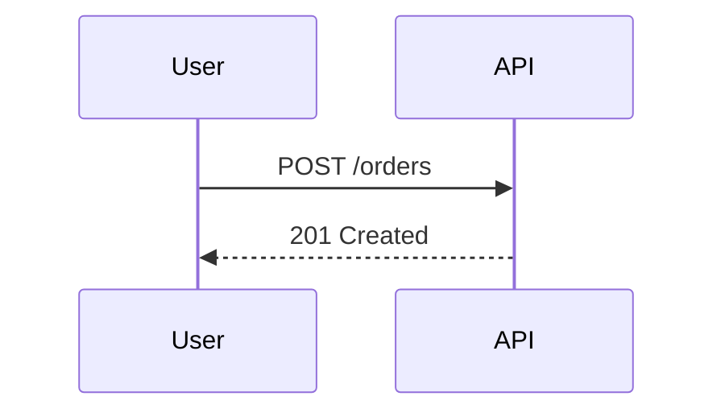

# Sequence diagram details

Sequence diagrams are read from top to bottom: preserve the order in which the
parties exchange messages. Keep one sequence subject in each fence. If the
input contains a separate flow, schema, class model, or state machine, give it
its own fence instead of turning the exchange into a chain of unrelated nodes.

## Participants and messages

Declare each participant before its first message, once, with a short
parser-safe ID and an optional readable label:

Use IDs made from letters, digits, and underscores, beginning with a letter.
Do not use Mermaid control words such as `end`, `alt`, `loop`, `note`, or
`activate` as IDs; choose a clear alternative such as `ENDPOINT` or
`AUTH_SERVICE`. Keep sender and receiver IDs exactly equal to their
declarations. An alias carries spaces or punctuation in the display label,
not in the ID.

Use one message per line. `->>` is a request or forward message and `-->>` is a
reply or return message. Preserve the direction and order stated in the input;
do not invent a reply merely because a request normally has one. Keep message
labels short and on one line. Every arrow must have a non-empty label after the
colon (`A ->> B: message`); never emit a bare `A ->> B` line. Keep labels and
notes converter-safe: prefer plain words, numbers, and short paths, and avoid
parentheses, brackets, semicolons, quotes, pipes, or a second colon. If a
detail needs punctuation, split it into another short message or phrase it in
words. If the input asks for a separate flow, schema, class model, or state
machine, put that in its own fence rather than changing the sequence fence into
another type.

## Type-specific depth

Use the vocabulary the source earns, at the effort level requested:

- A plain exchange needs only its participants and messages.
- A real response, error, or alternate outcome can use a reply and an `alt` /
  `else` / `end` block. A repeated exchange can use `loop ... end`.
- A phase or cross-participant explanation can use `Note over A,B: text`.
  Keep notes concise, use plain text, and attach them only to declared
  participants. Avoid punctuation-heavy note text for the same reason as
  message labels.
- If the source describes work being handled inside a participant, use
  `activate A` and `deactivate A` around that span. Use `autonumber` only when
  message order itself is important to the reader.

Use `opt`, `par`, `critical`, or `break` only when that construct is genuinely
what the source describes and the selected Mermaid renderer supports it. A
valid plain message is better than an ambitious construct that obscures the
exchange. Every `alt`, `loop`, or other block must have a matching `end`.

Do not use `== Phase ==` as a divider; it is not supported by the canvas
converter. Do not add a `direction` line, `subgraph`, flowchart syntax,
`classDef`, or arbitrary styling to a sequence fence. The sequence layout
already supplies the lifelines; visual emphasis should come from the
type-specific constructs and the meaning in the source.
