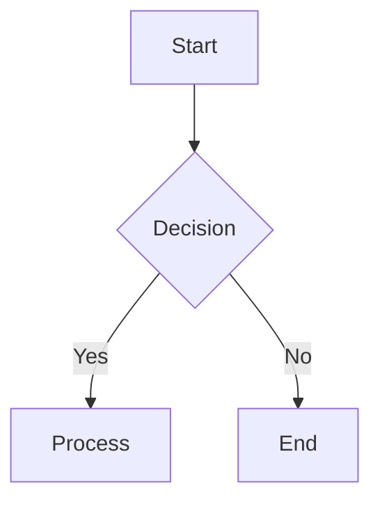

CRITICAL: Fix the mermaid syntax error below.

ORIGINAL REQUEST: "{{originalInput}}"

FAILED CODE:

```
{{failedCode}}
```

PARSE ERROR: {{errorMessage}}

{{specificFix}}

STRICT RULES - MUST FOLLOW:

1. ALWAYS wrap code in ```mermaid fences
2. NO indentation - every line starts at column 0 (no spaces/tabs at start)
3. If using |label| on arrow, target MUST be on SAME line
4. Every --> arrow must point to something on the same line
5. Each statement is ONE line only
6. No explanations outside the fences

CORRECT EXAMPLE:



INCORRECT (will fail):

```mermaid
flowchart TD   <-- missing newline after declaration
A[Start] <-- has spaces
B -->|Label| <-- missing target
C[End] <-- indented
```

SYNTAX: {{nodeSyntax}} | {{edgeSyntax}}

Rewrite the FAILED CODE above with proper fences and complete all arrows:

```mermaid
{{firstLine}}
```
