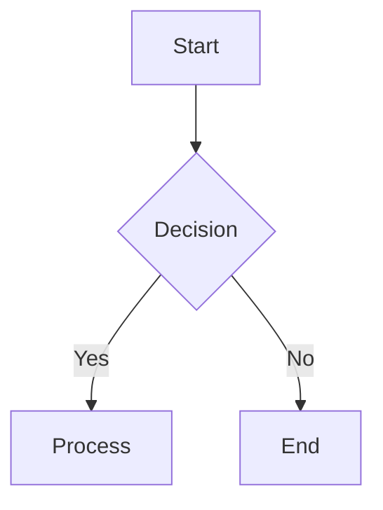

CRITICAL: Fix the mermaid syntax error below.

ORIGINAL REQUEST: "{{originalInput}}"

FAILED CODE:

```
{{failedCode}}
```

PARSE ERROR: {{errorMessage}}

{{specificFix}}

STRICT RULES - MUST FOLLOW:

1. ALWAYS wrap code in ```mermaid fences
2. If using |label| on an arrow, the target MUST be on the SAME line
3. Every --> arrow must point to something on the same line
4. Preserve indentation when the selected Mermaid type uses nesting
5. No explanations outside the fences

CORRECT EXAMPLE:


```mermaid
flowchart TD
A[Start] --> B{Decision}
B -->|Yes| C[Process]
B -->|No| D[End]
```

INCORRECT (will fail):

```mermaid
flowchart TD   <-- missing newline after declaration
 A[Start] <-- valid spacing is type-dependent
B -->|Label| <-- missing target
C[End] <-- this example is invalid for a different reason: it has no target
```

SYNTAX: {{nodeSyntax}} | {{edgeSyntax}}

Rewrite the FAILED CODE above with proper fences and complete all arrows:

```mermaid
{{firstLine}}
```
