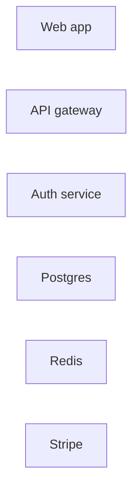

# Visual Vocabulary of `@excalidraw/mermaid-to-excalidraw` 2.2.2

Research for ticket #34, under map #38.

**Scope.** Establish _from primary source_ what the converter claims to support, so the
empirical browser harness in #46 knows what to verify. No production code is written here.

**Primary sources used.**

- The installed package. Root:
  `node_modules/.bun/@excalidraw+mermaid-to-excalidraw@2.2.2/node_modules/@excalidraw/mermaid-to-excalidraw`
  (`package.json` — `"version": "2.2.2"`). Cited below as `mte:dist/<path>:<line>`.
  Where a 2.0.0 behaviour is contrasted, it is cited explicitly as `mte@2.0.0:dist/...`.
- The installed mermaid 11.12.2. Root:
  `node_modules/.bun/mermaid@11.12.2/node_modules/mermaid`. Cited as `mermaid:dist/<path>`.
- `node_modules/.bun/@excalidraw+excalidraw@0.18.0+f178f9b1194b24ba/node_modules/@excalidraw/excalidraw/dist/types/excalidraw/`
  for the element schema and palette, and `open-color@1.9.1/open-color.json` for the palette values.
- <https://github.com/excalidraw/mermaid-to-excalidraw>

**Version note, read this first.** Sections 1–4 were originally written against **2.0.0**.
#50 bumped the dependency to **2.2.2** and this document has been re-verified against the
installed 2.2.2 `dist/`, which is the only authoritative artefact for what this repo runs
(`apps/app/lib/canvas/insert-mermaid-into-canvas.ts:5`, `apps/app/package.json:19` —
the range `^2.0.0` already permitted 2.2.2; only the lockfile pinned it). The npm releases are
not tagged on GitHub, so GitHub `master` is not a substitute for reading `dist/`.

### Version correction log (2.0.0 -> 2.2.2)

Everything below is stated for 2.2.2. This table records what the bump actually invalidated,
so nobody re-derives a 2.0.0 conclusion from an old note.

| Claim written against 2.0.0                                     | Status in 2.2.2           | Where                                                       |
| --------------------------------------------------------------- | ------------------------- | ----------------------------------------------------------- |
| `classDef` is a 4 + 1 property whitelist                        | **Still true**            | §1.1 — `mte:dist/interfaces.js:10-20`, byte-identical enums |
| `fill` / `stroke` accept any string                             | **Now false**             | §1.1 — gated by `isValidCSSColor`                           |
| Bare `style X ...` statements are unreliable, never emit them   | **Now false**             | §1.2 — `vertex.styles` is read directly from the DB         |
| Only the first class on a node is applied (`vertex.classes[0]`) | **Now false**             | §1.3 — every class is applied, in order                     |
| Subgraphs are containers but completely unstyled                | **Now false**             | §3.1 — `containerStyle` + `labelStyle` are spread onto them |
| A failed subgraph collapses the diagram to one `image`          | **Still true**            | §3.3 — unchanged `try`/`catch` -> `convertSvgToGraphImage`  |
| Two stray `console.log` calls spam the console                  | **Now false**             | §1.6 — both removed                                         |
| The shape switch is five cases, everything else is a rectangle  | **Still true**            | §4.1 — `VERTEX_TYPE` grew a sixth member with no `case`     |
| `A --o B` produces `endArrowhead: "dot"`                        | **Changed** -> `"circle"` | §4.4                                                        |
| Only flowchart / sequence / class are parsed structurally       | **Now false**             | §4.5 — `er` and `state` were added                          |
| Subgraph rectangle width is the raw mermaid cluster bbox        | **Changed**               | §3.1 — clamped to fit the label                             |

## Outline

1. Question 1 — `classDef` support: which CSS properties survive conversion
2. Question 2 — a semantic classDef palette for Rich and Deep
3. Question 3 — subgraphs and container frames
4. Question 4 — node shape matrix: what stays distinguishable after conversion
5. Construct support table (construct -> supported -> renders as -> tier)
6. Open questions handed to #46

---

## 1. `classDef` support: exactly four container properties and one label property

### 1.1 The whitelist is a closed enum, and colours are now validated

The converter does not interpret CSS. It switches on four literal property names and one
label property name, and drops everything else on the floor. Re-verified against 2.2.2 —
`mte:dist/interfaces.js:10-20` is byte-identical to 2.0.0's:

```js
LABEL_STYLE_PROPERTY["COLOR"] = "color";
CONTAINER_STYLE_PROPERTY["FILL"] = "fill";
CONTAINER_STYLE_PROPERTY["STROKE"] = "stroke";
CONTAINER_STYLE_PROPERTY["STROKE_WIDTH"] = "stroke-width";
CONTAINER_STYLE_PROPERTY["STROKE_DASHARRAY"] = "stroke-dasharray";
```

The mapping into Excalidraw element fields, `mte:dist/converter/helpers.js:51-90`, is also
unchanged:

| Mermaid CSS declaration  | Excalidraw skeleton field(s)                              | Notes                                                                               |
| ------------------------ | --------------------------------------------------------- | ----------------------------------------------------------------------------------- |
| `fill:<color>`           | `backgroundColor = <color>` **and** `fillStyle = "solid"` | `fillStyle` is hard-coded to `"solid"`; you cannot ask for `hachure`/`cross-hatch`. |
| `stroke:<color>`         | `strokeColor = <color>`                                   | —                                                                                   |
| `stroke-width:<n>[px]`   | `strokeWidth = Number(value.split("px")[0])`              | `"2px"` -> `2`. A non-numeric value yields `NaN`.                                   |
| `stroke-dasharray:<any>` | `strokeStyle = "dashed"`                                  | The value is **ignored entirely**. Any dasharray produces `dashed`, never `dotted`. |
| `color:<color>`          | bound-label `strokeColor = <color>`                       | Label text colour only, via `computeExcalidrawVertexLabelStyle`.                    |

Everything else a mermaid author might reach for — `opacity`, `rx`, `font-weight`,
`font-size`, `stroke-linecap`, `filter`, `text-decoration` — reaches the converter and is
silently discarded.

**What 2.2.2 adds: a validation gate in front of the whitelist.** The parser no longer copies
values straight through. `applyContainerStyleProperty` / `applyLabelStyleProperty`
(`mte:dist/parser/flowchart.js:4-22`) sit between the declaration and the style object:

```js
case CONTAINER_STYLE_PROPERTY.FILL:
case CONTAINER_STYLE_PROPERTY.STROKE:
  if (isValidCSSColor(value)) { style[key] = value; }
  break;
case CONTAINER_STYLE_PROPERTY.STROKE_WIDTH:
case CONTAINER_STYLE_PROPERTY.STROKE_DASHARRAY:
  style[key] = value;
  break;
```

`isValidCSSColor` (`mte:dist/parser/cssUtils.js:108-123`) delegates to `CSS.supports("color", v)`
when available, else to a throwaway `<div>`'s `style.color`, else returns **`false`**. Three
consequences:

- A malformed colour (`fill:#gg0000`, `fill:blueish`) is now **dropped** rather than written
  through to `backgroundColor` as garbage. Strictly better: a bad hex from the LLM degrades to
  the Excalidraw default instead of producing an invalid element.
- `stroke-width` and `stroke-dasharray` are **not** validated. `stroke-width:fat` still becomes
  `strokeWidth: NaN`.
- In an environment with neither `CSS` nor `document` — which is exactly a Node/happy-dom test
  runner — **every colour is silently rejected**. This is an independent reason, on top of the
  missing `getBBox`, that #46 must run in a real browser.

**So the five element fields the ticket asks about resolve as:**

- `backgroundColor` — **survives**, from `fill`, if it parses as a CSS colour.
- `strokeColor` — **survives**, from `stroke` (container) and `color` (label), same condition.
- `strokeWidth` — **survives**, from `stroke-width`, as a raw unvalidated number.
- `strokeStyle` — **survives as a single bit**: `dashed` if any `stroke-dasharray` is present,
  otherwise unset. `dotted` is unreachable through `classDef`.
- `fillStyle` — **does not survive as an author choice**. It is set to `"solid"` as a side
  effect of `fill`, and is otherwise absent (Excalidraw then defaults it).

### 1.2 `classDef` and bare `style` now both work — 2.0.0's shape-dependence is gone

This is the largest behavioural change in the bump, and it reverses the strongest
recommendation this document made against 2.0.0.

**In 2.0.0** there were two routes and only one was safe. The class-database route
(`db.getClasses()` -> `parseVertex`) was shape-independent, but 2.0.0 **never read
`vertex.styles`**, so a bare `style A fill:#f00` could only arrive through the rendered SVG, via
`node.querySelector(".label-container")?.getAttribute("style")`
(`mte@2.0.0:dist/parser/flowchart.js:53-55`). Mermaid 11 attaches computed styles to different
elements per shape — `drawRect` puts them on the `.label-container` itself, while `stadium`,
`hexagon`, `roundedRect` and friends put them on a child `<path>` — so `style` silently did
nothing on most non-rectangular shapes.

**In 2.2.2 `parseVertex` reads the style array off the vertex directly**
(`mte:dist/parser/flowchart.js:172-174`):

```js
vertex.styles?.forEach((styleText) => {
  applyStyleTextToStyles(styleText, containerStyle, labelStyle);
});
```

That array is populated by mermaid's own DB, no DOM involved: the grammar rule for a `style`
statement is `addVertex(id, undefined, undefined, styleList)`
(`mermaid:dist/chunks/mermaid.esm.min/flowDiagram-COCTKB5R.mjs`, parser case 121), and
`addVertex` does `a?.forEach(m => { f.styles.push(m) })`. So **`style` is now
shape-independent too.**

The DOM route still exists and now runs _after_ the DB routes, as an override
(`mte:dist/parser/flowchart.js:175-182`): the `.label-container`'s `style` attribute, then its
literal `fill` / `stroke` / `stroke-width` / `stroke-dasharray` **attributes**, then every
`.label` / `.nodeLabel` / `.label text` / `.label tspan` / `.label span` / `.label div` for the
label colour. Precedence inside `parseVertex` is therefore: classes -> `style` statements ->
rendered `style` attribute -> rendered presentation attributes, last write wins per property.

**Conclusion for the prompt vocabulary: still emit `classDef` + `:::`, but for economy, not
correctness.** One `classDef` line reused across N nodes costs far fewer tokens than N `style`
lines, and it keeps the palette in the stable prompt layer (§2.5). `style` is now a legitimate
escape hatch for a one-off override rather than a trap.

### 1.3 Mermaid 11 splits a `classDef` into `styles` and `textStyles` by substring match

`FlowDB.addClass` — `mermaid:dist/chunks/mermaid.esm.min/flowDiagram-COCTKB5R.mjs`, and typed
in `mermaid:dist/diagrams/flowchart/types.d.ts:50-54` as `FlowClass {id, styles, textStyles}`:

```js
addClass(ids, styleList) {
  const decls = styleList.join().replace(/\\,/g,"###").replace(/,/g,";").replace(/###/g,",").split(";");
  for (const id of ids.split(",")) {
    let cls = this.classes.get(id) ?? {id, styles: [], textStyles: []};
    for (const decl of decls) {
      if (/color/.exec(decl)) cls.textStyles.push(decl.replace("fill","bgFill"));
      cls.styles.push(decl);
    }
  }
}
```

(The real source uses a section-sign sentinel where this transcription uses `###`.)

Two consequences that matter for prompt design:

1. The test is a bare `/color/` substring match on the whole declaration. `color:#1e1e1e`
   correctly becomes a text style. But so would anything else containing the letters `color`.
2. Commas inside a `classDef` are separators, not value syntax. **Never emit
   `fill:rgb(165, 216, 255)`** — mermaid will split it into three broken declarations. Hex only.
   2.2.2's own `parseCSSDeclarations` is parenthesis-aware (`mte:dist/parser/cssUtils.js:76-85`),
   but that runs downstream of mermaid's split, so it cannot rescue the value. The same applies
   to `style` statements: the grammar's `stylesOpt` production splits on commas before the
   converter ever sees the text.

**Multi-class now works.** 2.0.0 read only
`Array.isArray(vertex.classes) ? vertex.classes[0] : vertex.classes` and dropped the rest.
2.2.2 iterates the whole list (`mte:dist/parser/flowchart.js:167-171`):

```js
(Array.isArray(vertex.classes) ? vertex.classes : [vertex.classes]).forEach(
  (classId) => {
    applyClassStyles(classId, classes, containerStyle, labelStyle);
  },
);
```

So `A:::svc:::hot` and `class A svc,hot` both apply, later class winning per property. The
vocabulary should still emit **one class per node** — a second class can only mutate the same
four properties, so it buys ambiguity and nothing else — but it is no longer a silent data loss.

`FlowDB.addVertex` still initialises `classes: []` and appends only from explicit `:::` / `class`
statements. A `classDef default ...` is applied by mermaid at render time via CSS and is
**never** in `vertex.classes`. It could in principle now arrive through the DOM override route
in §1.2, which is exactly the kind of thing #46 should measure rather than assume.
**Do not rely on `classDef default`.**

### 1.4 `!important`, and the hand-rolled CSS parser that replaced the naive split

mermaid 11's `styles2String` emits every declaration with ` !important` appended
(`mermaid:dist/chunks/mermaid.esm.min/chunk-5V7UUW6L.mjs`, `styles2String`). 2.0.0 added
`cleanCSSValue` to strip it; 2.2.2 keeps it verbatim (`mte:dist/parser/cssUtils.js:14-16`) and
adds `parseCSSDeclarations` (`:34-107`), a small hand-written tokenizer that replaces 2.0.0's
`split(";")`. It treats `;` **and** `,` as declaration separators at depth 0, tracks
parenthesis depth and quotes so `rgb(...)` / `url(...)` survive, lowercases property names, and
uses a `looksLikeDeclarationStart` lookahead so whitespace only terminates a value when the next
token really is `property:`.

Net effect for us: nothing to change in the emitted vocabulary, but malformed input is now far
more likely to be partially parsed than to throw.

`styles2String` also decides label-vs-node by an explicit property list (`isLabelStyle`:
`color`, `font-size`, `font-family`, `font-weight`, `font-style`, `text-decoration`,
`text-align`, `text-transform`, `line-height`, `letter-spacing`, `word-spacing`,
`text-shadow`, `text-overflow`, `white-space`, `word-wrap`, `word-break`, `overflow-wrap`,
`hyphens`). Only `color` from that list has any effect after conversion.

### 1.5 Values that survive into Excalidraw unchanged

`convertToExcalidrawElements` takes the skeleton's `strokeColor` / `backgroundColor` /
`strokeWidth` / `strokeStyle` / `fillStyle` as plain `ElementConstructorOpts`
(`@excalidraw/excalidraw/dist/types/excalidraw/data/transform.d.ts:43-53`). There is **no**
snapping to the Excalidraw palette and no validation of `strokeWidth`. Any hex string is
accepted verbatim.

Excalidraw's own canonical stroke widths are only three
(`.../excalidraw/constants.d.ts:258-262`):

```ts
STROKE_WIDTH = { thin: 1, bold: 2, extraBold: 4 };
```

Other numbers render (roughjs accepts them) but do not correspond to any toolbar state, so a
user who selects the element and looks at the sidebar sees nothing highlighted. **Emit only
`stroke-width:1px`, `2px`, or `4px`.**

### 1.6 The console spam is gone in 2.2.2

2.0.0 logged `"@", value` on **every** CSS declaration parsed
(`mte@2.0.0:dist/parser/cssUtils.js:15`) and dumped the whole element array from the sequence
converter (`mte@2.0.0:dist/converter/types/sequence.js:143`). Both are removed. The only
remaining console call in the entire 2.2.2 `dist/` is the deliberate
`console.error("Error processing Mermaid diagram:", error)` in the graphImage fallback
(`mte:dist/parseMermaid.js:119`) — which, per §3.3, is the _only_ runtime signal that a diagram
silently degraded, and is therefore worth hooking rather than suppressing.

### 1.7 What about the other diagram types?

- **Class diagrams** get styling: `mte:dist/parser/class.js:307-390` reads
  `classNode.styles || classNode.cssStyles`, plus the rendered `fill` / `stroke` /
  `stroke-width` / `stroke-dasharray` SVG attributes. Note `isMeaningfulColor` (`:364`)
  **rejects black** — `#000`, `#000000`, `black`, `rgb(0,0,0)` are treated as "unset". A
  near-black like `#1e1e1e` is accepted.
- **Sequence diagrams** get essentially nothing: the only colour input is `group.fill` for
  `rect` blocks. There is no `classDef` path.
- **ER and state diagrams** are new in 2.2.2 (`mte:dist/parser/er.js`, `mte:dist/parser/state.js`,
  wired at `mte:dist/parseMermaid.js:104-112` and `mte:dist/graphToExcalidraw.js:45-50`). They are
  out of scope for this ticket's vocabulary contract, which is flowchart-only, but they are the
  reason the "everything else becomes an image" claim in §4.5 had to be narrowed.

---

## 2. A semantic `classDef` palette for Rich and Deep

### 2.1 The governing constraint: Excalidraw dark mode is a canvas-wide CSS filter

Excalidraw does **not** store a second set of colours for dark theme. It applies one filter to
the whole rendered canvas:

```ts
// @excalidraw/excalidraw dist/types/excalidraw/constants.d.ts:209
export declare const THEME_FILTER = "invert(93%) hue-rotate(180deg)";
```

This is why a palette can be chosen once and be correct in both themes: `invert` flips
lightness, `hue-rotate(180deg)` puts the hue back where it started. Sanity check with the
standard CSS filter matrices — `#ffffff` maps to `#121212`, which is exactly Excalidraw's dark
canvas background, and `#1e1e1e` (the default text/stroke ink) maps to `#d3d3d3`.

The design rule that falls out: **pick light pastel fills and dark saturated strokes for the
light theme, and dark mode inverts them into dark fills with light strokes automatically.**
That is precisely the structure of Excalidraw's own element palette.

### 2.2 Anchor to `open-color`, at the exact two shades Excalidraw itself uses

Excalidraw's palette is `open-color` (`@excalidraw/excalidraw/dist/types/excalidraw/colors.d.ts:1`,
`import oc from "open-color"`), sampled at `ELEMENTS_PALETTE_SHADE_INDEXES = [0, 2, 4, 6, 8]`
(`colors.d.ts:18`). Its two defaults are:

- `DEFAULT_ELEMENT_BACKGROUND_COLOR_INDEX = 1` -> shade **2** (`colors.d.ts:17`)
- `DEFAULT_ELEMENT_STROKE_COLOR_INDEX = 4` -> shade **8** (`colors.d.ts:16`)

Shade 8 / shade 2 is literally the pair behind Excalidraw's five toolbar swatches
(`#1971c2` on `#a5d8ff` and friends). Using those two shades makes generated diagrams
indistinguishable from hand-drawn ones and means the user's own colour picker lands on the same
swatch when they select a generated node.

### 2.3 Proposed palette

All values are `open-color@1.9.1` shade 2 (fill) and shade 8 (stroke), verified against
`node_modules/.bun/open-color@1.9.1/node_modules/open-color/open-color.json`. The dark column is
the computed result of `invert(93%) hue-rotate(180deg)`.

| Semantic class       | Hue    | `fill` (light) | fill in dark | `stroke` (light) | stroke in dark |
| -------------------- | ------ | -------------- | ------------ | ---------------- | -------------- |
| Client / UI          | blue   | `#a5d8ff`      | `#154163`    | `#1971c2`        | `#56a2e8`      |
| Gateway              | violet | `#d0bfff`      | `#493b72`    | `#6741d9`        | `#b595ff`      |
| Service              | green  | `#b2f2bb`      | `#043b0c`    | `#2f9e44`        | `#3a994c`      |
| Database             | yellow | `#ffec99`      | `#362600`    | `#f08c00`        | `#b76100`      |
| Cache / Queue        | pink   | `#fcc2d7`      | `#602e41`    | `#c2255c`        | `#ff8dbc`      |
| External / 3rd party | gray   | `#e9ecef`      | `#202325`    | `#343a40`        | `#b8bdc2`      |

**Why these six and not the obvious ones.** The intuitive assignment puts Database on yellow and
Cache/Queue on orange. Measured in sRGB distance, `#ffec99` and `#ffd8a8` are only **25 apart in
light and 24 in dark** — indistinguishable on a hand-drawn fill at normal zoom. Swapping
Cache/Queue to pink raises the worst pair in the set to **50 (light) / 43 (dark)**. Candidate
sets and their scores are in the working note below; blue+cyan (25), indigo+violet (24) and
green+teal (32/40) fail for the same reason.

Red (`#ffc9c9` / `#e03131`) is deliberately **left out and reserved** as a later accent for
failure/alert paths, so the six semantic classes never compete with it.

**Legibility.** Default Excalidraw label ink `#1e1e1e` contrasts every fill above at
**≥ 9.99:1 in light theme and ≥ 6.5:1 in dark** (WCAG AA large text needs 3:1, AAA body needs
7:1). Stroke-on-fill contrast is ≥ 3.3:1 for every pair except green (2.68) and yellow (2.09),
which is fine for a 2px hand-drawn outline but is the reason `stroke-width` should stay at 2.

### 2.4 The exact `classDef` block to emit

```mermaid
classDef ui fill:#a5d8ff,stroke:#1971c2,stroke-width:2px
classDef gw fill:#d0bfff,stroke:#6741d9,stroke-width:2px
classDef svc fill:#b2f2bb,stroke:#2f9e44,stroke-width:2px
classDef db fill:#ffec99,stroke:#f08c00,stroke-width:2px
classDef cache fill:#fcc2d7,stroke:#c2255c,stroke-width:2px
classDef ext fill:#e9ecef,stroke:#343a40,stroke-width:2px,stroke-dasharray:4 4
```

Notes, each grounded in §1:

- **No `color:` declaration.** Excalidraw's default text ink is already `#1e1e1e`
  (`dist/prod/*.js`: `fillStyle:"hachure",...,strokeColor:Z.black,...,strokeWidth:1`), which is
  the highest-contrast choice on all six fills in both themes. Setting `color:` adds tokens, adds
  a failure mode, and can only make contrast worse.
- **`stroke-width:2px` everywhere.** The converter already hard-codes `strokeWidth: 2` on every
  vertex (`mte:dist/converter/types/flowchart.js:126`) before spreading the class style, so this
  is a no-op that documents intent. If a tier wants emphasis, `4px` is the only other legal value
  (`STROKE_WIDTH.extraBold`); `3px` renders but matches no toolbar state.
- **`stroke-dasharray` on `ext` only.** It is a one-bit channel — any value produces
  `strokeStyle: "dashed"` — so it can encode exactly one binary distinction. "Outside our system"
  is the highest-value use of that bit.
- **Hex only, never `rgb(...)`.** Commas separate declarations inside `classDef` (§1.3).
- **One class per node.** `A:::svc` only. 2.2.2 does apply a second class (§1.3), but it can only
  overwrite the same four properties, so a second class is ambiguity with no expressive gain.
- **Keep class ids out of the subgraph namespace.** `parseSubGraph` auto-applies a `classDef`
  whose id equals a subgraph's id (§3.2), so a `subgraph db[…]` would silently inherit `classDef db`.

Applying it — note the plain `["…"]` on the datastores: `[( )]` cylinders convert to rectangles
anyway and distort layout (§4.2), so the colour carries the whole "this is a database" signal:



### 2.5 Tier assignment

- **Fast** — no `classDef` at all. Six extra lines is a meaningful fraction of a Fast token
  budget, and the plain Excalidraw look is not a defect.
- **Rich** — the six-class block above, emitted as a static suffix. Because the block is byte-identical
  every time, it belongs in the stable `L1`/`L2` prompt layers, not in anything the user's transcript
  can move (map #38's prefix-caching decision).
- **Deep** — the same six classes. Deep's plan pass already produces entities and layers, so the
  render pass should map each planned entity to exactly one of the six. Do **not** invent a
  seventh colour per diagram: a stable palette across diagrams is worth more than a bespoke one
  within a diagram.

---

## 3. Subgraphs: real containers, now styleable — but still not Excalidraw frames

**This section was rewritten for 2.2.2.** Against 2.0.0 it concluded "subgraphs group but are
unstyled, do not put them in the colour vocabulary". That conclusion is dead. 2.2.2 applies
`classDef` to subgraph containers _and_ their labels.

### 3.1 What a `subgraph` becomes

`mte:dist/converter/types/flowchart.js:78-106`, the entire subgraph branch:

```js
graph.subGraphs.reverse().forEach((subGraph) => {
  const groupIds = getGroupIds(subGraph.id);
  const subGraphText = getText(subGraph);
  const safeFontSize = fontSize || 16;
  const estimatedTextWidth = estimateLabelWidth(subGraphText, safeFontSize);
  const minSubGraphWidth =
    estimatedTextWidth + SUBGRAPH_LABEL_HORIZONTAL_PADDING * 2;
  const width = Math.max(subGraph.width, minSubGraphWidth);
  const x = subGraph.x - (width - subGraph.width) / 2;
  const containerStyle = computeExcalidrawVertexStyle(subGraph.containerStyle);
  const labelStyle = computeExcalidrawVertexLabelStyle(subGraph.labelStyle);
  elements.push({
    id: subGraph.id,
    type: "rectangle",
    groupIds,
    x,
    y: subGraph.y,
    width,
    height: subGraph.height,
    label: {
      groupIds,
      text: subGraphText,
      fontSize,
      verticalAlign: "top",
      ...labelStyle,
    },
    ...containerStyle,
  });
});
```

So a subgraph is:

- a **plain `rectangle`** element with a **bound text label** anchored to the top;
- **styleable**, through exactly the same `computeExcalidrawVertexStyle` /
  `computeExcalidrawVertexLabelStyle` pair the vertices use (`mte:dist/converter/helpers.js:51-90`).
  The four container properties and the one label property of §1.1 apply verbatim, so a subgraph
  can carry `fill`, `stroke`, `stroke-width`, `stroke-dasharray` and a label `color`;
- **not** an Excalidraw `frame`. The flowchart converter never emits `type: "frame"`; only the
  _sequence_ converter does. Consequence: subgraph membership is expressed purely through shared
  `groupIds`, so moving the rectangle moves its contents (they are in the same group) but
  Excalidraw's frame semantics — clipping, frame-name editing, "add to frame on drop" — do
  **not** apply;
- **wider than mermaid's cluster when the title is long.** 2.2.2 clamps the width to
  `estimateLabelWidth(text, fontSize) + 64` and re-centres `x` (`:82-85`), where
  `estimateLabelWidth = max(20, ceil(len * fontSize * 0.62))` (`:10-12`). That estimate is a
  character-count heuristic, not a text measurement, so it will over-widen wide-character titles
  and under-widen narrow ones. #46 should measure it, because a subgraph rectangle that is wider
  than its mermaid cluster can now overlap a sibling that mermaid had laid out cleanly.

**Defaults when nothing is styled.** No `strokeColor`, no `backgroundColor`, no `strokeWidth`
are emitted, so Excalidraw's defaults apply: transparent background, `#1e1e1e` stroke,
`strokeWidth: 1`. Since vertices are still force-set to `strokeWidth: 2` (`:126`), an unstyled
subgraph outline reads lighter than the nodes inside it — the right visual hierarchy, still by
accident rather than design.

### 3.2 How style reaches a subgraph in 2.2.2

`parseSubGraph` (`mte:dist/parser/flowchart.js:97-144`) fills `containerStyle` / `labelStyle`
from five sources, applied in this order — later wins:

1. the cluster `<g>`'s own `style` attribute;
2. the cluster's shape element's `style` attribute, found by
   `:scope > rect, :scope > path, :scope > polygon, :scope > ellipse`, falling back to
   `.cluster > ...` and then to any descendant (`:120-124`);
3. that shape element's literal `fill` / `stroke` / `stroke-width` / `stroke-dasharray`
   **presentation attributes** (`:125`, via `applyElementAttributesToContainerStyle`);
4. **a `classDef` whose id equals the subgraph's own id** — `applyClassStyles(data.id, classes, …)`
   at `:130`;
5. **every class explicitly attached to the subgraph** — `data.classes?.forEach(…)` at `:131-133`.

Source 5 is the one the vocabulary should use. `FlowDB.setClass` pushes onto
`subGraphLookup.get(id).classes` (`mermaid:dist/chunks/mermaid.esm.min/flowDiagram-COCTKB5R.mjs`,
`setClass`), and `FlowSubGraph` has a `classes: string[]` field
(`mermaid:dist/diagrams/flowchart/types.d.ts:55-62`). Both spellings reach it:

```mermaid
subgraph backend["Backend services"]:::layer
  ...
end
```

```mermaid
class backend layer
```

Sources 1–3 are DOM reads and depend on how mermaid renders the cluster. In mermaid 11's default
look the cluster rect is inserted with `k.attr("style", nodeStyles)` and no presentation
attributes (`mermaid:dist/chunks/mermaid.esm.min/chunk-EQI6KKA3.mjs`, the `roundedWithTitle`
cluster renderer), and `nodeStyles` is empty unless the subgraph carries a class — so an unstyled
subgraph should pick up nothing. **Should**, from reading. #46 verifies it.

**Source 4 is a namespace hazard worth stating in the prompt rules.** A subgraph whose id happens
to match a `classDef` id inherits that class with no `:::` and no `class` statement. Since §2's
palette uses short ids (`ui`, `gw`, `svc`, `db`, `cache`, `ext`), a model that writes
`subgraph db["Data layer"]` gets `classDef db` applied to the container by accident. The prompt
must therefore **namespace subgraph ids away from class ids** — e.g. always
`subgraph layer_data["Data layer"]`.

### 3.3 Grouping and nesting: correct, including multi-level

`computeGroupIds` (`mte:dist/converter/types/flowchart.js:25-71`) builds a parent tree and emits
one group id per ancestor, named `subgraph_group_<subgraphId>`. Unchanged from 2.0.0.

Nesting works, and it works for a non-obvious reason worth recording so nobody "fixes" it:

1. mermaid pushes subgraphs in **completion order** — `addSubGraph` runs at the `end` token, so
   the innermost subgraph is `subGraphs[0]` (`mermaid:dist/chunks/mermaid.esm.min/flowDiagram-COCTKB5R.mjs`,
   `addSubGraph`).
2. `addSubGraph` also calls `makeUniq`, which strips nodes already claimed by an earlier (inner)
   subgraph. So an outer subgraph's `nodes` list contains the **inner subgraph's id** plus only
   its own direct children.
3. The converter therefore sets `tree[inner] = {parent: null}` while processing the inner
   subgraph, then overwrites it with `tree[inner] = {parent: outer}` when it reaches the outer one.
   Because inner always comes first, the overwrite is always in the right direction. Three or more
   levels chain correctly for the same reason.

`graph.subGraphs.reverse()` at `:78` mutates the array in place so outer rectangles are pushed
before inner ones, giving inner containers the higher z-order. This runs _after_ `computeGroupIds`,
so the tree is unaffected.

Two edges of this that #46 should probe:

- An **empty subgraph** (`subgraph X` / `end` with no nodes) never enters the tree, because
  `tree[subGraph.id]` is only assigned inside the `nodeIds.forEach` loop (`:28-41`). Its rectangle
  gets `groupIds: []` and is not grouped with anything.
- An edge is only added to a subgraph's group when **both** endpoints share the same immediate
  parent (`:184-188`). Cross-subgraph edges get `groupIds: []`, so dragging a subgraph leaves them
  behind visually until Excalidraw's arrow bindings re-route them.

### 3.4 The failure mode that matters most — unchanged in 2.2.2

`parseSubGraph` still throws `"SubGraph element not found"` if it cannot locate the cluster
`<g id="...">` in the rendered SVG (`mte:dist/parser/flowchart.js:107-110`). `parseMermaid` still
wraps the entire dispatch in one `try`/`catch` and, on **any** error, falls back to
`convertSvgToGraphImage` (`mte:dist/parseMermaid.js:113-121`) — the whole diagram becomes a single
base64 SVG **image element**. Zero bound arrows, zero draggable nodes, no text.

This was **reproduced during the 2.2.2 bump** (#50): one bad subgraph collapses the entire diagram
to a single `image` element rather than degrading gracefully by dropping just that container.

That is a total loss of the product's value from one bad subgraph, and it is silent — the only
signal is the `console.error` at `mte:dist/parseMermaid.js:119`. Two implications:

- Subgraph syntax carries more risk than any other construct in the vocabulary. Fast should not
  emit subgraphs at all.
- The pipeline should **detect the graphImage fallback** (a single `type: "image"` element, or
  `parseMermaid` returning `type: "graphImage"`) and treat it as a generation failure to retry,
  rather than inserting an image. This belongs in the tier-contract / recovery ticket, not here.

Note the asymmetry 2.2.2 introduced: **edges** now degrade gracefully. `parseMermaidFlowChartDiagram`
pre-filters edges whose DOM node is missing and drops any edge with fewer than two reflection
points (`mte:dist/parser/flowchart.js:271-283`) instead of letting `parseEdge` throw. Subgraphs got
no such treatment — they are the last construct that can still take the whole diagram down.

### 3.5 Syntax rules the prompt must state

- Always use the **two-token form**: `subgraph backend["Backend services"]`. With the one-token
  form, `addSubGraph` sets the id to `undefined` whenever the title contains whitespace and
  auto-generates `subGraph0`, `subGraph1`, … — which then leak into the Excalidraw element ids
  and any `A --> backend` reference breaks.
- **Prefix subgraph ids** so they cannot collide with a `classDef` id (§3.2, source 4) or with a
  node id. `layer_*` is the convention this document recommends.
- `direction TB` inside a subgraph is a mermaid layout hint only; nothing about it survives
  conversion beyond the resulting geometry.
- Style a subgraph with a class, never with a bare `style` statement: `parseSubGraph` reads
  `data.classes` but there is no subgraph equivalent of `vertex.styles`, so `style backend fill:…`
  can only arrive through the fragile DOM route.

### 3.6 Tier assignment

- **Fast** — no subgraphs. Highest-risk construct, and Fast's diagrams are small enough not to
  need grouping.
- **Rich** — one level of subgraph, used for tiers/layers (edge, application, data). Optionally a
  single low-contrast container class (see §5) now that container styling works.
- **Deep** — up to two levels; the plan pass already produces layers, which map onto exactly this.
  Do not go to three: nothing in the converter prevents it, but dagre's nested-cluster layout is
  where mermaid's own quality falls off, and every extra level multiplies the chance of the
  graphImage fallback.

---

## 4. Node shapes: five survive, eleven collapse to a rectangle

### 4.1 The converter's shape switch is still five cases with no default

`mte:dist/interfaces.js:1-9` — the shape enum grew a sixth member in 2.2.2:

```js
VERTEX_TYPE = {
  ROUND: "round",
  STADIUM: "stadium",
  DOUBLECIRCLE: "doublecircle",
  CIRCLE: "circle",
  DIAMOND: "diamond",
  CYLINDER: "cylinder", // new in 2.2.2
};
```

**`CYLINDER` is a trap for the reader: it has no `case` in the shape switch.** The switch at
`mte:dist/converter/types/flowchart.js:136-178` still handles exactly `STADIUM`, `ROUND`,
`DOUBLECIRCLE`, `CIRCLE`, `DIAMOND`, and still has **no `default` branch**. Every element starts
life as `{ type: "rectangle", strokeWidth: 2, ... }` at `:118-135`, so anything not in the five
stays a plain rectangle — cylinders included.

The enum member exists solely to feed `computeVertexLabelFontSize` (`:13-24`), which shrinks a
cylinder's bound-label font (never below 12px) so a long label fits the width mermaid measured
for the cylinder glyph. So the only thing 2.2.2 changed about `A[(Database)]` is that its label
may render **smaller** than every other node's — a new inconsistency, not a new capability.

Mermaid, meanwhile, produces **sixteen** classic vertex types
(`mermaid:dist/diagrams/flowchart/types.d.ts:6`):

```ts
type FlowVertexTypeParam =
  | undefined
  | "square"
  | "doublecircle"
  | "circle"
  | "ellipse"
  | "stadium"
  | "subroutine"
  | "rect"
  | "cylinder"
  | "round"
  | "diamond"
  | "hexagon"
  | "odd"
  | "trapezoid"
  | "inv_trapezoid"
  | "lean_right"
  | "lean_left";
```

The syntax-to-type mapping is in the generated parser
(`mermaid:dist/chunks/mermaid.esm.min/flowDiagram-COCTKB5R.mjs`, parser cases 56-71).

### 4.2 The matrix

"Distinguishable" means: after conversion, can a reader tell this node apart from a default
`A[Label]` box **by shape alone**?

| Mermaid syntax   | `vertex.type`   | Excalidraw output                    | Distinguishable?                                                                                                              |
| ---------------- | --------------- | ------------------------------------ | ----------------------------------------------------------------------------------------------------------------------------- |
| `A[Label]`       | `square`        | `rectangle`                          | baseline                                                                                                                      |
| `A(Label)`       | `round`         | `rectangle` + `roundness: {type: 3}` | **yes**                                                                                                                       |
| `A([Label])`     | `stadium`       | `rectangle` + `roundness: {type: 3}` | **no** — byte-identical to `A(Label)` apart from mermaid's wider bbox                                                         |
| `A((Label))`     | `circle`        | `ellipse`                            | **yes**                                                                                                                       |
| `A(((Label)))`   | `doublecircle`  | `ellipse` + a second inset `ellipse` | **yes**, but see 4.3                                                                                                          |
| `A{Label}`       | `diamond`       | `diamond`                            | **yes**                                                                                                                       |
| `A[(Label)]`     | `cylinder`      | `rectangle`, label font may shrink   | **no** — and 2.2.2 makes it worse, see 4.1                                                                                    |
| `A[[Label]]`     | `subroutine`    | `rectangle`                          | **no**                                                                                                                        |
| `A{{Label}}`     | `hexagon`       | `rectangle`                          | **no**                                                                                                                        |
| `A>Label]`       | `odd`           | `rectangle`                          | **no**                                                                                                                        |
| `A[/Label/]`     | `lean_right`    | `rectangle`                          | **no**                                                                                                                        |
| `A[\Label\]`     | `lean_left`     | `rectangle`                          | **no**                                                                                                                        |
| `A[/Label\]`     | `trapezoid`     | `rectangle`                          | **no**                                                                                                                        |
| `A[\Label/]`     | `inv_trapezoid` | `rectangle`                          | **no**                                                                                                                        |
| `A(-Label-)`     | `ellipse`       | `rectangle`                          | **no** — the converter's enum has no `ELLIPSE`                                                                                |
| `A@{shape: cyl}` | ShapeID string  | `rectangle`                          | **no** — mermaid 11's new shape syntax stores the raw ShapeID (`cyl`, `hex`, `diam`, …), which matches no `VERTEX_TYPE` value |

**Said plainly: `[(Database)]`, `[[Subroutine]]`, `{{Hexagon}}`, `[/Input/]`, `[\Output\]` and the
trapezoids are worthless in the prompt vocabulary.** They cost tokens, they add syntax the model
can get wrong, and the user sees a rectangle. The classic "cylinder means database" idiom that
every LLM reaches for by default is exactly the case that does not work — the semantic
`classDef db` colour from §2 is the only way to say "database".

Note also that the geometry still comes from the _real_ mermaid shape:
`parseVertex` takes `node.getBBox()` of the rendered hexagon/cylinder
(`mte:dist/parser/flowchart.js:159-163`). A `{{Hexagon}}` therefore becomes a rectangle padded to
hexagon width (mermaid pads hexagons by `padding * 2.5`), i.e. an oversized box. So the collapsed
shapes are not merely useless — they actively distort layout.

### 4.3 Caveats on the shapes that do survive

- **`A(Label)` vs `A([Label])` are the same output.** `roundness: {type: 3}` is
  `ROUNDNESS.ADAPTIVE_RADIUS` (`@excalidraw/excalidraw/dist/types/excalidraw/constants.d.ts:250-252`).
  Both branches (`mte:dist/converter/types/flowchart.js:137-144`) produce it. Pick **one** —
  `A(Label)` — and drop the other from the vocabulary; two spellings of one result is pure prompt
  entropy.
- **`A(((Label)))` renders its label twice.** The inner ellipse gets
  `label: { text: vertexText }` (`:159-164`) _and_ the outer container keeps its own label
  (`:127-132`). Two overlapping bound texts. Also the generated group id still has the stray brace
  it had in 2.0.0: `` `doublecircle_${vertex.id}}` `` (`:148`). Usable only as a terminal marker
  with a short label; #46 should confirm whether the double text is visible in practice.
- **`A{Label}` diamonds** are the one shape that survives and carries universally understood
  meaning (decision/branch). Keep it.

### 4.4 Edges: the other shape channel, and it is better than the node channel

`mte:dist/converter/types/flowchart.js:182-228` and `mte:dist/converter/helpers.js:6-32`:

| Mermaid edge       | `edge.type` / `edge.stroke` | Excalidraw result                                       |
| ------------------ | --------------------------- | ------------------------------------------------------- |
| `A --> B`          | `arrow_point` / `normal`    | arrow, `strokeWidth: 2`, Excalidraw's default arrowhead |
| `A --- B`          | `arrow_open` / `normal`     | `endArrowhead: null, startArrowhead: null` (open line)  |
| `A -.-> B`         | `arrow_point` / `dotted`    | `strokeStyle: "dashed"`                                 |
| `A ==> B`          | `arrow_point` / `thick`     | `strokeWidth: 4`                                        |
| `A <--> B`         | `double_arrow_point`        | `arrow` arrowheads on both ends                         |
| `A --o B`          | `arrow_circle`              | `endArrowhead: "circle"` — **was `"dot"` in 2.0.0**     |
| `A --x B`          | `arrow_cross`               | `endArrowhead: "bar"`                                   |
| `A -->\|label\| B` | any                         | bound arrow label at `fontSize`                         |
| `A ~~~ B`          | `arrow_open` / `invisible`  | **a visible open line** — see below                     |

All of these survive, and arrows are **bound** (`start`/`end` set to the vertex ids at `:220-225`),
which is the property the map cares about — a bound arrow re-routes when the user drags a node.

Corrections and traps:

- **`--o` changed arrowhead.** 2.0.0's `MERMAID_EDGE_TYPE_MAPPER` emitted `endArrowhead: "dot"`
  for `arrow_circle` and `double_arrow_circle` (`mte@2.0.0:dist/converter/helpers.js:7-20`);
  2.2.2 emits `"circle"` (`mte:dist/converter/helpers.js:7-20`). Both spellings are in
  Excalidraw 0.18.0's `Arrowhead` union
  (`@excalidraw/excalidraw/dist/types/excalidraw/element/types.d.ts:208`), but `"circle"` is the
  one the toolbar renders.
- **`~~~` (invisible link) is not invisible after conversion.** The converter only branches on
  `edge.stroke === "thick"` and `=== "dotted"` (`:210-211`); `"invisible"` falls through to a
  normal 2px stroke. Mermaid hides these links via CSS the converter never reads. **Never emit
  `~~~`** — it produces a visible connector the author explicitly asked to hide.
- **Edge colour is not supported at all.** The converter never reads `edge.style`, and
  `linkStyle 0 stroke:#f00` is silently discarded. Do not emit `linkStyle`.
- **Duplicate edges collide on id.** The arrow id is `` `${edge.start}_${edge.end}` `` (`:201`), so
  two `A --> B` lines produce two elements with the same id — and a node named `A_B` collides with
  the arrow for `A --> B` (the `_`-in-ids hazard already recorded in #33). Unchanged in 2.2.2.
- `computeExcalidrawArrowType` returns `undefined` for `arrow_point` (there is no entry in
  `MERMAID_EDGE_TYPE_MAPPER`), which spreads to nothing and lets Excalidraw's default arrowhead
  apply — correct behaviour, but it means the mapper only has entries for the _unusual_ arrow types.

### 4.5 The other diagram types have no shape vocabulary

- **Sequence**: the only element types accepted are `line`, `rectangle`, `ellipse`, `text`.
  Actors are rectangles (or ellipses for `actor`), and anything else throws. There is nothing an
  author can choose.
- **Class** (`mte:dist/parser/class.js`): every class is a `rectangle` plus `line` dividers. Shape
  is fixed; only colour is authorable (§1.7).
- **ER and state** are structurally parsed as of 2.2.2 (`mte:dist/parseMermaid.js:104-112`), so
  they are no longer images — but their vocabularies are unexplored and out of scope here.
- **Everything else** — gantt, pie, journey, mindmap, timeline — hits the `default` branch of
  `parseMermaid` (`mte:dist/parseMermaid.js:113-115`) and becomes a **single base64 SVG image**.
  Not editable, not bound, not draggable-as-parts.

### 4.6 Tier assignment for shapes

- **Fast** — `A[Label]` and `A{Decision}` only. Two shapes, both survive, both universally
  understood.
- **Rich** — add `A(Label)` (rounded, for start/end and external touchpoints) and `A((Label))`
  (circle, for junctions/events). Four shapes total.
- **Deep** — the same four plus `A(((Label)))` for terminal states, and only if #46 confirms the
  double-label issue in 4.3 is not visible.
- **No tier** may emit cylinders, hexagons, subroutines, parallelograms, trapezoids, the
  `@{shape: ...}` syntax, or `~~~` links.

---

## 5. Construct support table

This is the vocabulary contract. Sections 1–4 are the derivation; this section is the artefact
the spec lifts. Everything is stated for **converter 2.2.2 + mermaid 11.12.2**, flowchart only.

### 5.1 How to read it

**Supported** answers one question and only one: _does this construct produce bound, draggable,
individually-editable Excalidraw elements that reflect what the author asked for?_

- **yes** — converts as intended.
- **degraded** — converts without error, but the visual result is not what the syntax promises.
  These are the dangerous ones: nothing fails, the user just gets something wrong.
- **ignored** — parsed by mermaid, discarded by the converter. Costs tokens, changes nothing.
- **fatal** — can take the whole diagram down to a single `image` element (§3.4).

**Tier** is the highest tier permitted to emit the construct; a tier inherits everything below it.

- `Fast` — WebLLM, ~4096 total tokens (#35). Minimum syntax, maximum safety.
- `Rich` — one LLM call with a larger budget.
- `Deep` — two-pass plan + render.
- `none` — no tier may emit it. Either it does nothing, or it does the wrong thing.

### 5.2 Node shapes

| Construct                      | Supported    | Renders as                                                 | Tier   |
| ------------------------------ | ------------ | ---------------------------------------------------------- | ------ |
| `A["Label"]`                   | **yes**      | `rectangle`, `strokeWidth: 2`, bound label                 | Fast   |
| `A{"Label"}`                   | **yes**      | `diamond`                                                  | Fast   |
| `A("Label")`                   | **yes**      | `rectangle` + `roundness: {type: 3}`                       | Rich   |
| `A(("Label"))`                 | **yes**      | `ellipse`                                                  | Rich   |
| `A((("Label")))`               | **yes**\*    | `ellipse` + inset `ellipse`, label drawn **twice** (§4.3)  | Deep\* |
| `A(["Label"])` stadium         | **degraded** | identical to `A("Label")` — a second spelling of one thing | none   |
| `A[("Label")]` cylinder        | **degraded** | `rectangle`, label font may auto-shrink (§4.1)             | none   |
| `A[["Label"]]` subroutine      | **degraded** | `rectangle`, widened to subroutine bbox                    | none   |
| `A{{"Label"}}` hexagon         | **degraded** | `rectangle`, widened by `padding * 2.5`                    | none   |
| `A>"Label"]` odd               | **degraded** | `rectangle`                                                | none   |
| `A[/"Label"/]`, `A[\"Label"\]` | **degraded** | `rectangle`                                                | none   |
| `A[/"Label"\]`, `A[\"Label"/]` | **degraded** | `rectangle`                                                | none   |
| `A(-"Label"-)` ellipse         | **degraded** | `rectangle` — no `ELLIPSE` in `VERTEX_TYPE`                | none   |
| `A@{ shape: cyl }`             | **degraded** | `rectangle` — ShapeID matches no `VERTEX_TYPE` value       | none   |

\* Deep may emit the triple-circle only if #46 confirms the doubled label is not visible.

**Label text inside a shape**

| Construct                            | Supported    | Renders as                                                | Tier |
| ------------------------------------ | ------------ | --------------------------------------------------------- | ---- |
| Quoted label `A["Auth service"]`     | **yes**      | bound text, `\n` normalised to a real newline             | Fast |
| Unquoted label `A[Auth service]`     | **yes**      | same, but breaks on `,` `(` `)` `[` `]` — never emit      | none |
| Markdown label ``A["`**bold**`"]``   | **degraded** | markdown stripped by `removeMarkdown`, plain text         | none |
| FontAwesome `A["fa:fa-database DB"]` | **degraded** | icon token stripped, text kept (`removeFontAwesomeIcons`) | none |
| HTML entity `A["A #35; B"]`          | **yes**      | decoded by `entityCodesToText`                            | none |

### 5.3 Edges

| Construct                     | Supported    | Renders as                                                      | Tier |
| ----------------------------- | ------------ | --------------------------------------------------------------- | ---- |
| `A --> B`                     | **yes**      | bound `arrow`, `strokeWidth: 2`, default arrowhead              | Fast |
| `A -->\|"label"\| B`          | **yes**      | same + bound arrow label                                        | Fast |
| `A -- "label" --> B`          | **yes**      | identical to the pipe form — pick one spelling                  | Fast |
| `A --- B`                     | **yes**      | open line, both arrowheads `null`                               | Rich |
| `A -.-> B`                    | **yes**      | `strokeStyle: "dashed"` + default arrowhead                     | Rich |
| `A ==> B`                     | **yes**      | `strokeWidth: 4`                                                | Rich |
| `A <--> B`                    | **yes**      | `arrow` arrowheads on both ends                                 | Rich |
| `A --o B`                     | **yes**      | `endArrowhead: "circle"` (was `"dot"` in 2.0.0)                 | none |
| `A --x B`                     | **yes**      | `endArrowhead: "bar"`                                           | none |
| `A ~~~ B` invisible link      | **degraded** | a **visible** 2px open line — `"invisible"` is never handled    | none |
| `A --> B --> C` chain         | **yes**      | expands to two independent bound arrows                         | Fast |
| `A & B --> C`                 | **yes**      | expands to two independent bound arrows                         | Rich |
| Duplicate `A --> B`           | **degraded** | two elements sharing the id `A_B` (§4.4)                        | none |
| Self-loop `A --> A`           | **unknown**  | id `A_A`; dropped if the DOM path has < 2 points — #46 verifies | none |
| `linkStyle 0 stroke:...`      | **ignored**  | `edge.style` is never read; edge colour is unreachable          | none |
| `class E1 myclass` on an edge | **ignored**  | mermaid records it, the converter never reads edge classes      | none |

Arrows are **bound** at both ends (`start`/`end` set to the vertex ids), which is what makes them
re-route on drag. This is the single most valuable property in the whole vocabulary; nothing in
this table should be traded against it.

### 5.4 Styling

| Construct                           | Supported    | Renders as                                                        | Tier |
| ----------------------------------- | ------------ | ----------------------------------------------------------------- | ---- |
| `classDef c fill:#hex`              | **yes**      | `backgroundColor` + `fillStyle: "solid"`                          | Rich |
| `classDef c stroke:#hex`            | **yes**      | `strokeColor`                                                     | Rich |
| `classDef c stroke-width:2px`       | **yes**      | `strokeWidth: 2` (only `1` / `2` / `4` map to toolbar states)     | Rich |
| `classDef c stroke-dasharray:4 4`   | **yes**      | `strokeStyle: "dashed"` — value ignored, one bit only             | Rich |
| `classDef c color:#hex`             | **yes**      | bound-label `strokeColor`                                         | none |
| `A:::c`                             | **yes**      | applies class `c`                                                 | Rich |
| `class A,B c`                       | **yes**      | applies class `c` to both                                         | Rich |
| `A:::c1:::c2` / `class A c1,c2`     | **yes**      | all classes applied, later wins per property (new in 2.2.2)       | none |
| `style A fill:#hex,stroke:#hex`     | **yes**      | same fields as `classDef`, shape-independent since 2.2.2 (§1.2)   | none |
| `classDef default ...`              | **unknown**  | not in `vertex.classes`; may leak via the DOM route — #46 decides | none |
| `fill:rgb(1, 2, 3)`                 | **degraded** | mermaid splits on the commas first; three broken declarations     | none |
| Any other CSS property              | **ignored**  | dropped by the whitelist switch (§1.1)                            | none |
| Invalid colour, e.g. `fill:#gg0000` | **ignored**  | rejected by `isValidCSSColor`, falls back to Excalidraw's default | none |

The six-class palette in §2.4 is the entire sanctioned use of this row group. `Rich` and `Deep`
emit that block verbatim and nothing else; `Fast` emits no styling at all.

### 5.5 Grouping

| Construct                                  | Supported    | Renders as                                                       | Tier |
| ------------------------------------------ | ------------ | ---------------------------------------------------------------- | ---- |
| `subgraph id["Title"]` … `end`             | **fatal**    | `rectangle` + top-anchored label + shared `groupIds` (§3.1)      | Rich |
| One-token `subgraph My Title`              | **degraded** | id becomes `subGraph0`; every reference to it breaks (§3.5)      | none |
| Nested subgraphs, 2 levels                 | **fatal**    | correct parent chain, inner container on top (§3.3)              | Deep |
| Nested subgraphs, 3+ levels                | **fatal**    | works, but multiplies graphImage-fallback risk                   | none |
| `subgraph id["T"]:::c` / `class id c`      | **yes**      | container **and** label styled — new in 2.2.2 (§3.2)             | Rich |
| `style <subgraphId> ...`                   | **degraded** | no subgraph equivalent of `vertex.styles`; DOM route only        | none |
| Empty subgraph (no nodes)                  | **unknown**  | source says rectangle with `groupIds: []`; may not render at all | none |
| Cross-subgraph edge                        | **degraded** | arrow gets `groupIds: []`, left behind on drag until re-route    | Rich |
| Subgraph id colliding with a `classDef` id | **degraded** | silently inherits that class (§3.2, source 4)                    | none |
| `direction TB` inside a subgraph           | **ignored**  | layout hint; nothing survives beyond the resulting geometry      | Rich |

`subgraph` is marked **fatal** rather than **yes** because it is the one construct that can still
collapse the entire diagram to a single `image` (§3.4) — edges degrade gracefully in 2.2.2,
subgraphs do not. It is permitted from Rich upward because the layering it expresses is worth the
risk at those budgets, not because the risk is small.

### 5.6 Diagram-level constructs

| Construct                              | Supported   | Renders as                                                    | Tier |
| -------------------------------------- | ----------- | ------------------------------------------------------------- | ---- |
| `flowchart LR` / `TD` / `TB`           | **yes**     | layout direction only; baked into element coordinates         | Fast |
| `flowchart RL` / `BT`                  | **yes**     | same, but reversed reading order confuses small models        | none |
| `graph LR` (legacy keyword)            | **yes**     | `diagram.type === "graph"`, same code path                    | none |
| `%% comment`                           | **yes**     | stripped by mermaid, no elements                              | Rich |
| `click A href "https://…"`             | **yes**     | Excalidraw element `link` (converter `:133`)                  | none |
| `%%{init: {...}}%%` directives         | **unknown** | changes the rendered SVG the parser reads from — #46 verifies | none |
| YAML frontmatter (`---` … `---`)       | **ignored** | `title:` and friends produce no element                       | none |
| `sequenceDiagram`                      | partial     | fixed shapes, no `classDef` (§1.7, §4.5)                      | none |
| `classDiagram`                         | partial     | `rectangle` + divider `line`s, colour only                    | none |
| `erDiagram` / `stateDiagram-v2`        | partial     | structurally parsed as of 2.2.2, vocabulary unexplored        | none |
| gantt, pie, journey, mindmap, timeline | **fatal**   | one base64 SVG `image`; nothing draggable or bound            | none |

### 5.7 Identifier rules that cut across every row

These are constraints on ids, not constructs, but a violation is as destructive as an unsupported
construct so the contract has to carry them.

- **No `_` in node ids.** Arrow ids are `` `${start}_${end}` ``, so a node named `A_B` collides
  with the arrow for `A --> B` (#33). Use `apiGw`, never `api_gw`.
- **Prefix subgraph ids** (`layer_*`) so they collide with neither node ids nor `classDef` ids
  (§3.2, §3.5). This is the one place `_` is safe, because subgraph ids never form an arrow id.
- **Always quote labels.** `A[Read, then write]` breaks the parser; `A["Read, then write"]` does not.
- **Hex colours only**, never `rgb()`/`hsl()`, because mermaid splits declarations on commas
  before the converter sees them (§1.3).

### 5.8 The emit list, restated

What a tier is actually allowed to produce, in full:

- **Fast** — `flowchart LR|TD`; `A["…"]`, `A{"…"}`; `A --> B`, `A -->|"…"| B`; chains. Nothing else.
- **Rich** — Fast, plus `A("…")`, `A(("…"))`; `A --- B`, `A -.-> B`, `A ==> B`, `A <--> B`;
  `A & B --> C`; `%%` comments; the §2.4 six-class `classDef` block with `:::`; one level of
  `subgraph layer_x["…"]`, optionally classed.
- **Deep** — Rich, plus `A((("…")))` (pending #46) and a second level of subgraph nesting.

Everything not on this list is forbidden to every tier.

---

## 6. Open questions handed to #46

Everything above is derived from reading source. This section lists what source-reading
**cannot** settle, phrased so #46 can turn each item into an assertion and hand back a diff
against the §5 table.

### 6.1 The harness must run in Playwright, for two independent reasons

1. **`getBBox` does not exist in happy-dom.** Mermaid's layout depends on it, so the rendered SVG
   has no measurable geometry and `parseMermaidToExcalidraw` yields **zero elements**. Reproduced
   during the 2.2.2 bump (#50). This is not a stub-able gap: `parseVertex`, `parseSubGraph` and
   `computeElementPosition` all call `getBBox()` on real layout
   (`mte:dist/parser/flowchart.js:113`, `:159`, `:222`).
2. **`isValidCSSColor` returns `false` when neither `CSS` nor `document` is available**
   (`mte:dist/parser/cssUtils.js:113-122`). In a DOM-less runner every `fill:` and `stroke:` is
   silently dropped, so a styling test would pass vacuously — worse than failing. New in 2.2.2;
   2.0.0 had no such gate.

The existing `apps/app/lib/canvas/insert-mermaid-into-canvas.test.ts` does not import the code it
claims to test (#38), so there is no prior art to extend. Assume a fresh Playwright fixture that
mounts Excalidraw, runs `parseMermaidToExcalidraw` + `convertToExcalidrawElements`, and asserts on
the returned element array plus a screenshot.

### 6.2 The palette has never been seen, only computed

§2 is the weakest part of this document. Every number in it — the sRGB distances, the dark-column
hex values, the contrast ratios — was **computed by applying the CSS filter matrices by hand**.
Not one of them was observed on a canvas. `THEME_FILTER = "invert(93%) hue-rotate(180deg)"`
(`@excalidraw/excalidraw/dist/types/excalidraw/constants.d.ts:209`) is applied by the browser to
the composited canvas, and browsers implement `hue-rotate` with the linear approximation matrix
from the filter-effects spec, which is **not** a true hue rotation. Saturated colours come back
noticeably shifted. This is exactly where hand-computation goes wrong.

**Q6.2.1 — Do the six fills stay mutually distinguishable in dark theme?**
Render one node per class from the §2.4 block, screenshot in light and in dark, sample the actual
composited pixel at each node's centre, and compute the real pairwise sRGB distances. §2.3 claims
a worst pair of 50 light / 43 dark. _If the measured dark worst-pair falls below ~35, the palette
needs re-picking and §2 is wrong._

**Q6.2.2 — Does the default label ink stay legible on every fill in dark theme?**
§2.4 deliberately emits no `color:` declaration on the theory that Excalidraw's `#1e1e1e` ink
inverts to a light grey that clears 6.5:1 on all six fills. Measure the real contrast ratio of
sampled label pixel against sampled fill pixel, both themes. _If any pair drops below 4.5:1, the
palette needs an explicit `color:` and §1.1's label-colour row becomes load-bearing._

**Q6.2.3 — Do the strokes stay visible against their own fills?**
§2.3 records stroke-on-fill contrast of 2.68 (green) and 2.09 (yellow) and argues 2px hand-drawn
outlines carry it. That is an aesthetic judgement made from numbers. Screenshot at 100% and at
50% zoom and decide by eye whether the outline reads. _If it does not, either the stroke shade
moves from open-color 8 to 9, or `stroke-width` goes to 4px for those two classes._

**Q6.2.4 — Does a generated node land on an Excalidraw toolbar swatch?**
§2.2's argument for open-color shades 2 and 8 is that a user selecting a generated node sees their
own colour picker highlight the matching swatch. Verify by selecting a generated node in the real
editor and looking at the sidebar. _If nothing highlights, the "indistinguishable from hand-drawn"
justification for these specific shades collapses and any pleasant palette would do._

### 6.3 Subgraph styling in 2.2.2 — read, not observed

§3 was rewritten from source for this ticket. The rewrite is confident about the code path and
uncertain about what mermaid actually renders into it.

**Q6.3.1 — Does `subgraph layer_x["Title"]:::c` actually colour the container?**
The converter spreads `computeExcalidrawVertexStyle(subGraph.containerStyle)` onto the rectangle
(`mte:dist/converter/types/flowchart.js:86`, `:103`), and `parseSubGraph` fills `containerStyle`
from `data.classes` (`mte:dist/parser/flowchart.js:131-133`). Assert that the emitted rectangle
carries `backgroundColor`, `strokeColor`, `strokeWidth` and `fillStyle: "solid"`. Test both
spellings — `:::` on the `subgraph` line and a separate `class layer_x c` statement — because
they take different routes into `FlowSubGraph.classes`.

**Q6.3.2 — Does the subgraph _label_ pick up `color:`?**
`labelStyle` is spread into the bound label (`:101`). Nothing in the source says mermaid puts a
cluster label where `applyStyleTextToLabelStyle` expects it. Assert the label's `strokeColor`.

**Q6.3.3 — Does an _unstyled_ subgraph stay transparent?**
This is the regression risk of the whole feature. `parseSubGraph` reads the cluster shape's
`style` attribute _and_ its `fill`/`stroke` presentation attributes (`:123-125`). Reading
mermaid's cluster renderer, the rect gets `.attr("style", nodeStyles)` and no presentation
attributes, and `nodeStyles` is empty for an unclassed cluster
(`mermaid:dist/chunks/mermaid.esm.min/chunk-EQI6KKA3.mjs`, the `roundedWithTitle` renderer) — so
nothing should leak. Verify. _If a theme fill does leak, every generated subgraph silently gains a
background and §3.1's "transparent by default" note is wrong._

**Q6.3.4 — Same question for unstyled vertices.**
`parseVertex` now also reads the `.label-container`'s presentation attributes (`:177`). Mermaid's
`drawRect` sets only `style`, not `fill`/`stroke`, so an unclassed node should stay default.
Verify, because a leak here would repaint every node in every diagram, including Fast's.

**Q6.3.5 — Is the widened subgraph rectangle a problem?**
2.2.2 clamps subgraph width to `max(clusterWidth, 0.62 * len(title) * fontSize + 64)` and
re-centres it (`mte:dist/converter/types/flowchart.js:82-85`). That is a character-count estimate,
not a text measurement. Render two sibling subgraphs with long titles and check whether the
widened rectangles overlap each other or clip their contents. _If they do, the vocabulary needs a
title-length cap._

**Q6.3.6 — Does `classDef default` reach anything?**
§1.3 says it never lands in `vertex.classes`, but 2.2.2's DOM override route could pick it up from
the rendered `style` attribute. One fixture settles it. _A yes would make `classDef default` a
one-line way to restyle a whole diagram, which is materially cheaper than per-node classes._

### 6.4 The failure surface

**Q6.4.1 — Reproduce and characterise the subgraph collapse.**
`parseSubGraph` throws `"SubGraph element not found"` when the cluster `<g>` cannot be located
(`mte:dist/parser/flowchart.js:107-110`), `parseMermaid` catches **any** error and falls back to
`convertSvgToGraphImage` (`mte:dist/parseMermaid.js:118-121`), and the entire diagram becomes a
single base64 SVG **`image`** element — no bound arrows, no draggable nodes, no text. This was
reproduced during the 2.2.2 bump (#50) and is the single worst failure in the pipeline, because
it is silent: the only signal is one `console.error`.

#46 should find **which inputs trigger it**, since that is what the prompt rules must forbid.
Candidates worth fixturing: an empty subgraph; a subgraph id containing a quote, a bracket, a
space, or a leading digit; a subgraph id colliding with a node id; a subgraph referenced by an
edge from outside; three-level nesting; a subgraph whose title contains `#` entity codes.

**Q6.4.2 — Confirm the detection signature.**
The recovery ticket needs a reliable predicate. Check that the collapse is detectable as
`elements.length === 1 && elements[0].type === "image"`, and whether `parseMermaid`'s
`type: "graphImage"` is observable through `parseMermaidToExcalidraw`'s public return. _The answer
decides whether recovery can be implemented without patching the library._

**Q6.4.3 — Do edges really degrade gracefully now?**
2.2.2 pre-filters edges whose DOM node is missing and drops any edge with fewer than two
reflection points (`mte:dist/parser/flowchart.js:271-283`) instead of throwing. Confirm with a
self-loop `A --> A`, which is the most likely producer of a degenerate path. _If a self-loop is
silently dropped, §5.3 gets a definite row instead of an `unknown`._

### 6.5 Shape and label artefacts

**Q6.5.1 — Is `A((("X")))`'s doubled label visible?**
Both the outer ellipse and the inner ellipse get a bound label with the same text
(`mte:dist/converter/types/flowchart.js:127-132`, `:159-164`). Screenshot it. _This is the only
gate on Deep being allowed the triple-circle at all (§5.2)._

**Q6.5.2 — How badly do collapsed shapes distort layout?**
Geometry comes from the real mermaid glyph's `getBBox()`, so `{{Hex}}` becomes a rectangle padded
to hexagon width. Measure the width delta between `A["Text"]` and `A{{"Text"}}` for identical
text. _This turns §4.2's "actively distort layout" from an argument into a number the prompt rules
can cite._

**Q6.5.3 — Does the cylinder's shrunken label look broken?**
New in 2.2.2: a `cylinder` vertex gets its bound-label font size reduced, floor 12px
(`mte:dist/converter/types/flowchart.js:13-24`). Since the shape still converts to a plain
rectangle, the result is a rectangle whose text is smaller than its neighbours' for no visible
reason. Confirm, as further evidence for the §5.2 ban.

**Q6.5.4 — Is `A ~~~ B` visible?**
Source says `"invisible"` is never handled and the arrow gets a normal 2px stroke
(`mte:dist/converter/types/flowchart.js:210-211`). Confirm on a screenshot; it is a one-line
fixture and it justifies an explicit prohibition in the prompt.

### 6.6 What #46 should hand back

Not a prose report. Two artefacts:

1. **A diff against the §5 table** — every row whose `Supported` grade or `Renders as` column the
   measurements contradict. §5 is the contract; if it is wrong, it must be corrected before the
   spec quotes it.
2. **A fixture corpus** — the mermaid sources and their expected element shapes, checked in, so
   the next converter bump can be re-verified by running it instead of by reading `dist/` again.
   This is also the seed for the "diagram quality evaluation" item still listed as unspecified in
   map #38.
