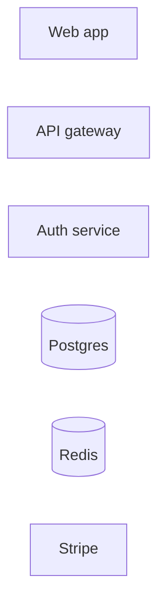

# Visual Vocabulary of `@excalidraw/mermaid-to-excalidraw` 2.0.0

Research for ticket #34, under map #38.

**Scope.** Establish _from primary source_ what the converter claims to support, so the
empirical browser harness in #46 knows what to verify. No production code is written here.

**Primary sources used.**

- The installed package. Root:
  `node_modules/.bun/@excalidraw+mermaid-to-excalidraw@2.0.0/node_modules/@excalidraw/mermaid-to-excalidraw`.
  Cited below as `mte:dist/<path>:<line>`.
- The installed mermaid 11.12.2. Root:
  `node_modules/.bun/mermaid@11.12.2/node_modules/mermaid`. Cited as `mermaid:dist/<path>`.
- `node_modules/.bun/@excalidraw+excalidraw@0.18.0+f178f9b1194b24ba/node_modules/@excalidraw/excalidraw/dist/types/excalidraw/`
  for the element schema and palette, and `open-color@1.9.1/open-color.json` for the palette values.
- <https://github.com/excalidraw/mermaid-to-excalidraw>

**Version note, read this first.** npm `2.0.0` is _not_ tagged on GitHub — the newest tag in
<https://github.com/excalidraw/mermaid-to-excalidraw/tags> is `v1.1.0`, and `master`'s
`package.json` already says `2.1.1`. Everything below is derived from the **installed 2.0.0
`dist/`**, which is the only authoritative artefact for what this repo actually runs
(`apps/app/lib/canvas/insert-mermaid-into-canvas.ts:5`, `apps/app/package.json:19`).
GitHub `master` is a preview of a _later_ version and differs — notably it adds
`src/parser/er.ts` and `src/parser/state.ts`, which 2.0.0 does not have.

## Outline

1. Question 1 — `classDef` support: which CSS properties survive conversion
2. Question 2 — a semantic classDef palette for Rich and Deep
3. Question 3 — subgraphs and container frames
4. Question 4 — node shape matrix: what stays distinguishable after conversion
5. Construct support table (construct -> supported -> renders as -> tier)
6. Open questions handed to #46

---

## 1. `classDef` support: exactly four container properties and one label property

### 1.1 The whitelist is a closed enum

The converter does not interpret CSS. It switches on four literal property names and one
label property name, and drops everything else on the floor.

`mte:dist/interfaces.js:9-19`:

```js
LABEL_STYLE_PROPERTY["COLOR"] = "color";
CONTAINER_STYLE_PROPERTY["FILL"] = "fill";
CONTAINER_STYLE_PROPERTY["STROKE"] = "stroke";
CONTAINER_STYLE_PROPERTY["STROKE_WIDTH"] = "stroke-width";
CONTAINER_STYLE_PROPERTY["STROKE_DASHARRAY"] = "stroke-dasharray";
```

The mapping into Excalidraw element fields, `mte:dist/converter/helpers.js:51-90`:

| Mermaid CSS declaration  | Excalidraw skeleton field(s)                              | Notes                                                                               |
| ------------------------ | --------------------------------------------------------- | ----------------------------------------------------------------------------------- |
| `fill:<color>`           | `backgroundColor = <color>` **and** `fillStyle = "solid"` | `fillStyle` is hard-coded to `"solid"`; you cannot ask for `hachure`/`cross-hatch`. |
| `stroke:<color>`         | `strokeColor = <color>`                                   | —                                                                                   |
| `stroke-width:<n>[px]`   | `strokeWidth = Number(value.split("px")[0])`              | `"2px"` -> `2`. A non-numeric value yields `NaN`.                                   |
| `stroke-dasharray:<any>` | `strokeStyle = "dashed"`                                  | The value is **ignored entirely**. Any dasharray produces `dashed`, never `dotted`. |
| `color:<color>`          | bound-label `strokeColor = <color>`                       | Label text colour only, via `computeExcalidrawVertexLabelStyle`.                    |

Everything else a mermaid author might reach for — `opacity`, `rx`, `font-weight`,
`font-size`, `stroke-linecap`, `filter`, `text-decoration` — reaches the converter and is
silently discarded by the `switch` default.

**So the five element fields the ticket asks about resolve as:**

- `backgroundColor` — **survives**, from `fill`.
- `strokeColor` — **survives**, from `stroke` (container) and `color` (label).
- `strokeWidth` — **survives**, from `stroke-width`, as a raw number.
- `strokeStyle` — **survives as a single bit**: `dashed` if any `stroke-dasharray` is present,
  otherwise unset. `dotted` is unreachable through `classDef`.
- `fillStyle` — **does not survive as an author choice**. It is set to `"solid"` as a side
  effect of `fill`, and is otherwise absent (Excalidraw then defaults it).

### 1.2 `classDef` is the reliable path; bare `style` statements are not

There are two independent routes by which mermaid styling can reach the converter, and only
one of them is shape-independent.

**Route A — the class database (reliable).** `parseMermaidFlowChartDiagram` calls
`db.getClasses()` and hands the map to `parseVertex`, which merges `classDef.styles` into
`containerStyle` and `classDef.textStyles` into `labelStyle` — `mte:dist/parser/flowchart.js:167`
and `:79-97`. This never touches the DOM, so it works for every node shape.

**Route B — the rendered SVG (fragile).** `parseVertex` also reads
`node.querySelector(".label-container")?.getAttribute("style")` — `mte:dist/parser/flowchart.js:53-55`.
This is the only route by which a bare `style A fill:#f00` statement can arrive, because the
converter never reads `vertex.styles`. But in mermaid 11's default (non-`handDrawn`) look,
different shape renderers attach the computed style to different elements:

- `drawRect` (backing `squareRect`, i.e. `A[text]`) sets it on the `.label-container` itself:
  `p.attr("class","basic label-container").attr("style", nodeStyles)`
  — `mermaid:dist/chunks/mermaid.esm.min/chunk-EQI6KKA3.mjs`, function `drawRect`.
- `stadium`, `hexagon`, `roundedRect`, `slopedRect` and friends instead do
  `g.attr("class","basic label-container"); nodeStyles && g.selectChildren("path").attr("style", nodeStyles)`
  — the style lands on a **child** `<path>`, so `getAttribute("style")` on the container
  returns `null`.

**Conclusion for the prompt vocabulary: emit `classDef` + `:::` / `class`, never bare `style`
statements.** `style` is shape-dependent and will silently do nothing on most non-rectangular
shapes. This is the single most important prompt-authoring rule in this document.

### 1.3 Mermaid 11 splits a `classDef` into `styles` and `textStyles` by substring match

`FlowDB.addClass` — `mermaid:dist/chunks/mermaid.esm.min/flowDiagram-COCTKB5R.mjs`, and typed
in `mermaid:dist/diagrams/flowchart/types.d.ts:50-54` as `FlowClass {id, styles, textStyles}`:

```js
addClass(ids, styleList) {
  const decls = styleList.join().replace(/\\,/g,"§§§").replace(/,/g,";").replace(/§§§/g,",").split(";");
  for (const id of ids.split(",")) {
    let cls = this.classes.get(id) ?? {id, styles: [], textStyles: []};
    for (const decl of decls) {
      if (/color/.exec(decl)) cls.textStyles.push(decl.replace("fill","bgFill"));
      cls.styles.push(decl);
    }
  }
}
```

Two consequences that matter for prompt design:

1. The test is a bare `/color/` substring match on the whole declaration. `color:#1e1e1e`
   correctly becomes a text style. But so would anything else containing the letters `color`.
2. Commas inside a `classDef` are separators, not value syntax. **Never emit
   `fill:rgb(165, 216, 255)`** — mermaid will split it into three broken declarations. Hex only.

Separately, `mte:dist/parser/flowchart.js:80` reads only
`Array.isArray(vertex.classes) ? vertex.classes[0] : vertex.classes` — **only the first class
on a node is applied.** `A:::svc:::hot` or `class A svc,hot` silently drops `hot`.

And `FlowDB.addVertex` initialises `classes: []` and appends only from explicit `:::` / `class`
statements. A `classDef default ...` is applied by mermaid at render time via CSS and is
**never** in `vertex.classes`, so it never reaches route A. Do not rely on `classDef default`.

### 1.4 `!important` and why 2.0.0 needed `cleanCSSValue`

mermaid 11's `styles2String` emits every declaration with ` !important` appended
(`mermaid:dist/chunks/mermaid.esm.min/chunk-5V7UUW6L.mjs`, `styles2String`). 2.0.0 added
`cleanCSSValue` — `mte:dist/parser/cssUtils.js:14-17` — to strip it. That is the fix that
makes styling work at all on mermaid 11; 1.1.2 (mermaid 10.9.3) predates it.

`styles2String` also decides label-vs-node by an explicit property list (`isLabelStyle`:
`color`, `font-size`, `font-family`, `font-weight`, `font-style`, `text-decoration`,
`text-align`, `text-transform`, `line-height`, `letter-spacing`, `word-spacing`,
`text-shadow`, `text-overflow`, `white-space`, `word-wrap`, `word-break`, `overflow-wrap`,
`hyphens`). Only `color` from that list has any effect after conversion.

### 1.5 Values that survive into Excalidraw unchanged

`convertToExcalidrawElements` takes the skeleton's `strokeColor` / `backgroundColor` /
`strokeWidth` / `strokeStyle` / `fillStyle` as plain `ElementConstructorOpts`
(`@excalidraw/excalidraw/dist/types/excalidraw/data/transform.d.ts:43-53`). There is **no**
snapping to the Excalidraw palette and no validation of `strokeWidth`. Any hex string is
accepted verbatim.

Excalidraw's own canonical stroke widths are only three
(`.../excalidraw/constants.d.ts:258-262`):

```ts
STROKE_WIDTH = { thin: 1, bold: 2, extraBold: 4 };
```

Other numbers render (roughjs accepts them) but do not correspond to any toolbar state, so a
user who selects the element and looks at the sidebar sees nothing highlighted. **Emit only
`stroke-width:1px`, `2px`, or `4px`.**

### 1.6 Two stray `console.log` calls in 2.0.0

`mte:dist/parser/cssUtils.js:15` logs `"@", value` on **every CSS declaration parsed**, and
`mte:dist/converter/types/sequence.js:143` logs the whole element array. A styled diagram will
spam the console proportionally to its `classDef` count. Cosmetic, but it will be noticed in
auto mode where generation is continuous.

### 1.7 What about sequence and class diagrams?

- **Class diagrams** do get styling in 2.0.0: `mte:dist/parser/class.js:94-190` reads
  `classNode.styles || classNode.cssStyles`, plus the rendered `fill` / `stroke` /
  `stroke-width` / `stroke-dasharray` SVG attributes, and maps them to `bgColor`,
  `strokeColor`, `strokeWidth`, `strokeStyle` on the container. Note `isMeaningfulColor`
  (`:153-166`) **rejects black** — `#000`, `#000000`, `black`, `rgb(0,0,0)` are treated as
  "unset". A near-black like `#1e1e1e` is accepted.
- **Sequence diagrams** get essentially nothing: the only colour input is `group.fill` for
  `rect` blocks (`mte:dist/converter/types/sequence.js:108`). There is no `classDef` path.

---

## 2. A semantic `classDef` palette for Rich and Deep

### 2.1 The governing constraint: Excalidraw dark mode is a canvas-wide CSS filter

Excalidraw does **not** store a second set of colours for dark theme. It applies one filter to
the whole rendered canvas:

```ts
// @excalidraw/excalidraw dist/types/excalidraw/constants.d.ts:209
export declare const THEME_FILTER = "invert(93%) hue-rotate(180deg)";
```

This is why a palette can be chosen once and be correct in both themes: `invert` flips
lightness, `hue-rotate(180deg)` puts the hue back where it started. Sanity check with the
standard CSS filter matrices — `#ffffff` maps to `#121212`, which is exactly Excalidraw's dark
canvas background, and `#1e1e1e` (the default text/stroke ink) maps to `#d3d3d3`.

The design rule that falls out: **pick light pastel fills and dark saturated strokes for the
light theme, and dark mode inverts them into dark fills with light strokes automatically.**
That is precisely the structure of Excalidraw's own element palette.

### 2.2 Anchor to `open-color`, at the exact two shades Excalidraw itself uses

Excalidraw's palette is `open-color` (`@excalidraw/excalidraw/dist/types/excalidraw/colors.d.ts:1`,
`import oc from "open-color"`), sampled at `ELEMENTS_PALETTE_SHADE_INDEXES = [0, 2, 4, 6, 8]`
(`colors.d.ts:18`). Its two defaults are:

- `DEFAULT_ELEMENT_BACKGROUND_COLOR_INDEX = 1` -> shade **2** (`colors.d.ts:17`)
- `DEFAULT_ELEMENT_STROKE_COLOR_INDEX = 4` -> shade **8** (`colors.d.ts:16`)

Shade 8 / shade 2 is literally the pair behind Excalidraw's five toolbar swatches
(`#1971c2` on `#a5d8ff` and friends). Using those two shades makes generated diagrams
indistinguishable from hand-drawn ones and means the user's own colour picker lands on the same
swatch when they select a generated node.

### 2.3 Proposed palette

All values are `open-color@1.9.1` shade 2 (fill) and shade 8 (stroke), verified against
`node_modules/.bun/open-color@1.9.1/node_modules/open-color/open-color.json`. The dark column is
the computed result of `invert(93%) hue-rotate(180deg)`.

| Semantic class       | Hue    | `fill` (light) | fill in dark | `stroke` (light) | stroke in dark |
| -------------------- | ------ | -------------- | ------------ | ---------------- | -------------- |
| Client / UI          | blue   | `#a5d8ff`      | `#154163`    | `#1971c2`        | `#56a2e8`      |
| Gateway              | violet | `#d0bfff`      | `#493b72`    | `#6741d9`        | `#b595ff`      |
| Service              | green  | `#b2f2bb`      | `#043b0c`    | `#2f9e44`        | `#3a994c`      |
| Database             | yellow | `#ffec99`      | `#362600`    | `#f08c00`        | `#b76100`      |
| Cache / Queue        | pink   | `#fcc2d7`      | `#602e41`    | `#c2255c`        | `#ff8dbc`      |
| External / 3rd party | gray   | `#e9ecef`      | `#202325`    | `#343a40`        | `#b8bdc2`      |

**Why these six and not the obvious ones.** The intuitive assignment puts Database on yellow and
Cache/Queue on orange. Measured in sRGB distance, `#ffec99` and `#ffd8a8` are only **25 apart in
light and 24 in dark** — indistinguishable on a hand-drawn fill at normal zoom. Swapping
Cache/Queue to pink raises the worst pair in the set to **50 (light) / 43 (dark)**. Candidate
sets and their scores are in the working note below; blue+cyan (25), indigo+violet (24) and
green+teal (32/40) fail for the same reason.

Red (`#ffc9c9` / `#e03131`) is deliberately **left out and reserved** as a later accent for
failure/alert paths, so the six semantic classes never compete with it.

**Legibility.** Default Excalidraw label ink `#1e1e1e` contrasts every fill above at
**≥ 9.99:1 in light theme and ≥ 6.5:1 in dark** (WCAG AA large text needs 3:1, AAA body needs
7:1). Stroke-on-fill contrast is ≥ 3.3:1 for every pair except green (2.68) and yellow (2.09),
which is fine for a 2px hand-drawn outline but is the reason `stroke-width` should stay at 2.

### 2.4 The exact `classDef` block to emit

```mermaid
classDef ui fill:#a5d8ff,stroke:#1971c2,stroke-width:2px
classDef gw fill:#d0bfff,stroke:#6741d9,stroke-width:2px
classDef svc fill:#b2f2bb,stroke:#2f9e44,stroke-width:2px
classDef db fill:#ffec99,stroke:#f08c00,stroke-width:2px
classDef cache fill:#fcc2d7,stroke:#c2255c,stroke-width:2px
classDef ext fill:#e9ecef,stroke:#343a40,stroke-width:2px,stroke-dasharray:4 4
```

Notes, each grounded in §1:

- **No `color:` declaration.** Excalidraw's default text ink is already `#1e1e1e`
  (`dist/prod/*.js`: `fillStyle:"hachure",...,strokeColor:Z.black,...,strokeWidth:1`), which is
  the highest-contrast choice on all six fills in both themes. Setting `color:` adds tokens, adds
  a failure mode, and can only make contrast worse.
- **`stroke-width:2px` everywhere.** The converter already hard-codes `strokeWidth: 2` on every
  vertex (`mte:dist/converter/types/flowchart.js:93`) before spreading the class style, so this is
  a no-op that documents intent. If a tier wants emphasis, `4px` is the only other legal value
  (`STROKE_WIDTH.extraBold`); `3px` renders but matches no toolbar state.
- **`stroke-dasharray` on `ext` only.** It is a one-bit channel — any value produces
  `strokeStyle: "dashed"` — so it can encode exactly one binary distinction. "Outside our system"
  is the highest-value use of that bit.
- **Hex only, never `rgb(...)`.** Commas separate declarations inside `classDef` (§1.3).
- **One class per node.** `A:::svc` only; the converter reads `vertex.classes[0]` (§1.3).

Applying it:



### 2.5 Tier assignment

- **Fast** — no `classDef` at all. Six extra lines is a meaningful fraction of a Fast token
  budget, and the plain Excalidraw look is not a defect.
- **Rich** — the six-class block above, emitted as a static suffix. Because the block is byte-identical
  every time, it belongs in the stable `L1`/`L2` prompt layers, not in anything the user's transcript
  can move (map #38's prefix-caching decision).
- **Deep** — the same six classes. Deep's plan pass already produces entities and layers, so the
  render pass should map each planned entity to exactly one of the six. Do **not** invent a
  seventh colour per diagram: a stable palette across diagrams is worth more than a bespoke one
  within a diagram.

---

## 3. Subgraphs: real containers, but plain ones — and not Excalidraw frames

### 3.1 What a `subgraph` becomes

`mte:dist/converter/types/flowchart.js:57-75`, the entire subgraph branch:

```js
graph.subGraphs.reverse().forEach((subGraph) => {
  const groupIds = getGroupIds(subGraph.id);
  elements.push({
    id: subGraph.id,
    type: "rectangle",
    groupIds,
    x,
    y,
    width,
    height, // straight from the rendered mermaid cluster bbox
    label: {
      groupIds,
      text: getText(subGraph),
      fontSize,
      verticalAlign: "top",
    },
  });
});
```

So a subgraph is:

- a **plain `rectangle`** element with a **bound text label** anchored to the top;
- **not** an Excalidraw `frame`. The flowchart converter never emits `type: "frame"`; only the
  _sequence_ converter does (`mte:dist/converter/types/sequence.js:136-141`). Consequence:
  subgraph membership is expressed purely through shared `groupIds`, so moving the rectangle
  moves its contents (they are in the same group) but Excalidraw's frame semantics — clipping,
  frame-name editing, "add to frame on drop" — do **not** apply.
- **completely unstyled.** No `strokeColor`, no `backgroundColor`, no `strokeWidth`. Excalidraw's
  defaults apply: transparent background, `#1e1e1e` stroke, `strokeWidth: 1`. Since vertices are
  forced to `strokeWidth: 2` (`:93`), subgraph outlines naturally read as lighter than nodes,
  which is the right visual hierarchy by accident rather than by design.

**`classDef` does not reach subgraphs.** mermaid records the class (`FlowDB.setClass` pushes onto
`subGraphLookup.get(id).classes`, and `FlowSubGraph` has a `classes: string[]` field —
`mermaid:dist/diagrams/flowchart/types.d.ts:55-62`), but the converter's `SubGraph` interface has
no style fields at all (`mte:dist/interfaces.d.ts:36-45`) and `parseSubGraph`
(`mte:dist/parser/flowchart.js:3-32`) never reads `data.classes`. `class Backend svc` on a
subgraph is silently a no-op. **Do not put subgraphs in the prompt's colour vocabulary.**

### 3.2 Grouping and nesting: correct, including multi-level

`computeGroupIds` (`mte:dist/converter/types/flowchart.js:4-50`) builds a parent tree and emits
one group id per ancestor, named `subgraph_group_<subgraphId>`.

Nesting works, and it works for a non-obvious reason worth recording so nobody "fixes" it:

1. mermaid pushes subgraphs in **completion order** — `addSubGraph` runs at the `end` token, so
   the innermost subgraph is `subGraphs[0]` (`mermaid:dist/chunks/mermaid.esm.min/flowDiagram-COCTKB5R.mjs`,
   `addSubGraph`: `this.subGraphs.push(F)`).
2. `addSubGraph` also calls `F.nodes = this.makeUniq(F, this.subGraphs).nodes`, which strips nodes
   already claimed by an earlier (inner) subgraph. So an outer subgraph's `nodes` list contains the
   **inner subgraph's id** plus only its own direct children.
3. The converter therefore sets `tree[inner] = {parent: null}` while processing the inner
   subgraph, then overwrites it with `tree[inner] = {parent: outer}` when it reaches the outer one.
   Because inner always comes first, the overwrite is always in the right direction. Three or more
   levels chain correctly for the same reason.

`graph.subGraphs.reverse()` at `:57` mutates the array in place so outer rectangles are pushed
before inner ones, giving inner containers the higher z-order. This runs _after_ `computeGroupIds`,
so the tree is unaffected.

Two edges of this that #46 should probe:

- An **empty subgraph** (`subgraph X` / `end` with no nodes) never enters the tree, because
  `tree[subGraph.id]` is only assigned inside the `nodeIds.forEach` loop (`:8-19`). Its rectangle
  gets `groupIds: []` and is not grouped with anything.
- An edge is only added to a subgraph's group when **both** endpoints share the same immediate
  parent (`:150-154`). Cross-subgraph edges get `groupIds: []`, so dragging a subgraph leaves them
  behind visually until Excalidraw's arrow bindings re-route them.

### 3.3 The failure mode that matters most

`parseSubGraph` throws `"SubGraph element not found"` if it cannot locate the cluster
`<g id="...">` in the rendered SVG (`mte:dist/parser/flowchart.js:13-16`). `parseMermaid` wraps the
entire dispatch in one `try/catch` and, on **any** error, falls back to
`convertSvgToGraphImage` (`mte:dist/parseMermaid.js:74-82`) — the whole diagram becomes a single
base64 SVG **image element**. Zero bound arrows, zero draggable nodes, no text.

That is a total loss of the product's value from one bad subgraph, and it is silent — the only
signal is a `console.error`. Two implications:

- Subgraph syntax carries more risk than any other construct in the vocabulary. Fast should not
  emit subgraphs at all.
- The pipeline should **detect the graphImage fallback** (a single `type: "image"` element, or
  `parseMermaid` returning `type: "graphImage"`) and treat it as a generation failure to retry,
  rather than inserting an image. This belongs in the tier-contract / recovery ticket, not here.

### 3.4 Syntax rules the prompt must state

- Always use the **two-token form**: `subgraph backend["Backend services"]`. With the one-token
  form, `addSubGraph` sets the id to `undefined` whenever the title contains whitespace and
  auto-generates `subGraph0`, `subGraph1`, … — which then leak into the Excalidraw element ids
  and any `A --> backend` reference breaks.
- Subgraph ids share a namespace with node ids. A collision silently reparents nodes.
- `direction TB` inside a subgraph is a mermaid layout hint only; nothing about it survives
  conversion beyond the resulting geometry.

### 3.5 Tier assignment

- **Fast** — no subgraphs. Highest-risk construct, and Fast's diagrams are small enough not to
  need grouping.
- **Rich** — one level of subgraph, used for tiers/layers (edge, application, data).
- **Deep** — up to two levels; the plan pass already produces layers, which map onto exactly this.
  Do not go to three: nothing in the converter prevents it, but dagre's nested-cluster layout is
  where mermaid's own quality falls off, and every extra level multiplies the chance of the
  graphImage fallback.

---

## 4. Node shapes: five survive, eleven collapse to a rectangle

### 4.1 The converter's shape switch is five cases with no default

`mte:dist/interfaces.js:1-8` — the entire shape vocabulary the converter knows:

```js
VERTEX_TYPE = {
  ROUND: "round",
  STADIUM: "stadium",
  DOUBLECIRCLE: "doublecircle",
  CIRCLE: "circle",
  DIAMOND: "diamond",
};
```

`mte:dist/converter/types/flowchart.js:103-144` switches on `vertex.type` over exactly those
five and has **no `default` branch**. Every element starts life as
`{ type: "rectangle", strokeWidth: 2, ... }` at `:85-102`, so anything not in the five stays a
plain rectangle.

Mermaid, meanwhile, produces **sixteen** classic vertex types
(`mermaid:dist/diagrams/flowchart/types.d.ts:6`):

```ts
type FlowVertexTypeParam =
  | undefined
  | "square"
  | "doublecircle"
  | "circle"
  | "ellipse"
  | "stadium"
  | "subroutine"
  | "rect"
  | "cylinder"
  | "round"
  | "diamond"
  | "hexagon"
  | "odd"
  | "trapezoid"
  | "inv_trapezoid"
  | "lean_right"
  | "lean_left";
```

The syntax-to-type mapping is in the generated parser
(`mermaid:dist/chunks/mermaid.esm.min/flowDiagram-COCTKB5R.mjs`, parser cases 56-71).

### 4.2 The matrix

"Distinguishable" means: after conversion, can a reader tell this node apart from a default
`A[Label]` box **by shape alone**?

| Mermaid syntax   | `vertex.type`   | Excalidraw output                    | Distinguishable?                                                                                                              |
| ---------------- | --------------- | ------------------------------------ | ----------------------------------------------------------------------------------------------------------------------------- |
| `A[Label]`       | `square`        | `rectangle`                          | baseline                                                                                                                      |
| `A(Label)`       | `round`         | `rectangle` + `roundness: {type: 3}` | **yes**                                                                                                                       |
| `A([Label])`     | `stadium`       | `rectangle` + `roundness: {type: 3}` | **no** — byte-identical to `A(Label)` apart from mermaid's wider bbox                                                         |
| `A((Label))`     | `circle`        | `ellipse`                            | **yes**                                                                                                                       |
| `A(((Label)))`   | `doublecircle`  | `ellipse` + a second inset `ellipse` | **yes**, but see 4.3                                                                                                          |
| `A{Label}`       | `diamond`       | `diamond`                            | **yes**                                                                                                                       |
| `A[(Label)]`     | `cylinder`      | `rectangle`                          | **no**                                                                                                                        |
| `A[[Label]]`     | `subroutine`    | `rectangle`                          | **no**                                                                                                                        |
| `A{{Label}}`     | `hexagon`       | `rectangle`                          | **no**                                                                                                                        |
| `A>Label]`       | `odd`           | `rectangle`                          | **no**                                                                                                                        |
| `A[/Label/]`     | `lean_right`    | `rectangle`                          | **no**                                                                                                                        |
| `A[\Label\]`     | `lean_left`     | `rectangle`                          | **no**                                                                                                                        |
| `A[/Label\]`     | `trapezoid`     | `rectangle`                          | **no**                                                                                                                        |
| `A[\Label/]`     | `inv_trapezoid` | `rectangle`                          | **no**                                                                                                                        |
| `A(-Label-)`     | `ellipse`       | `rectangle`                          | **no** — the converter's enum has no `ELLIPSE`                                                                                |
| `A@{shape: cyl}` | ShapeID string  | `rectangle`                          | **no** — mermaid 11's new shape syntax stores the raw ShapeID (`cyl`, `hex`, `diam`, …), which matches no `VERTEX_TYPE` value |

**Said plainly: `[(Database)]`, `[[Subroutine]]`, `{{Hexagon}}`, `[/Input/]`, `[\Output\]` and the
trapezoids are worthless in the prompt vocabulary.** They cost tokens, they add syntax the model
can get wrong, and the user sees a rectangle. The classic "cylinder means database" idiom that
every LLM reaches for by default is exactly the case that does not work — the semantic
`classDef db` colour from §2 is the only way to say "database".

Note also that the geometry still comes from the _real_ mermaid shape:
`parseVertex` takes `node.getBBox()` of the rendered hexagon/cylinder
(`mte:dist/parser/flowchart.js:47-51`). A `{{Hexagon}}` therefore becomes a rectangle padded to
hexagon width (mermaid pads hexagons by `padding * 2.5`), i.e. an oversized box. So the collapsed
shapes are not merely useless — they actively distort layout.

### 4.3 Caveats on the shapes that do survive

- **`A(Label)` vs `A([Label])` are the same output.** `roundness: {type: 3}` is
  `ROUNDNESS.ADAPTIVE_RADIUS` (`@excalidraw/excalidraw/dist/types/excalidraw/constants.d.ts:250-252`).
  Both branches (`:104-111`) produce it. Pick **one** — `A(Label)` — and drop the other from the
  vocabulary; two spellings of one result is pure prompt entropy.
- **`A(((Label)))` renders its label twice.** The inner ellipse gets
  `label: { text: getText(vertex) }` (`:126-130`) _and_ the outer container keeps its own label
  (`:94-99`). Two overlapping bound texts. Also the generated group id has a stray brace:
  `` `doublecircle_${vertex.id}}` `` (`:115`). Usable only as a terminal marker with a short
  label; #46 should confirm whether the double text is visible in practice.
- **`A{Label}` diamonds** are the one shape that survives and carries universally understood
  meaning (decision/branch). Keep it.

### 4.4 Edges: the other shape channel, and it is better than the node channel

`mte:dist/converter/types/flowchart.js:148-197` and `mte:dist/converter/helpers.js:6-32`:

| Mermaid edge | Excalidraw result                                      |
| ------------ | ------------------------------------------------------ | --- | ------------------------------- |
| `A --> B`    | arrow, `strokeWidth: 2`, `endArrowhead: "arrow"`       |
| `A --- B`    | `endArrowhead: null, startArrowhead: null` (open line) |
| `A -.-> B`   | `strokeStyle: "dashed"` (`edge.stroke === "dotted"`)   |
| `A ==> B`    | `strokeWidth: 4` (`edge.stroke === "thick"`)           |
| `A <--> B`   | arrowheads on both ends                                |
| `A --o B`    | `endArrowhead: "dot"`                                  |
| `A --x B`    | `endArrowhead: "bar"`                                  |
| `A -->       | label                                                  | B`  | bound arrow label at `fontSize` |

All of these survive, and arrows are **bound** (`containerElement.start/end = {id}` at `:190-195`),
which is the property the map cares about — a bound arrow re-routes when the user drags a node.

The gap: **edge colour is not supported at all.** The converter never reads `edge.style`, and
`linkStyle 0 stroke:#f00` is silently discarded. Do not emit `linkStyle`.

`computeExcalidrawArrowType` returns `undefined` for `arrow_point` (there is no entry in
`MERMAID_EDGE_TYPE_MAPPER`), which spreads to nothing and lets Excalidraw's default arrowhead
apply — correct behaviour, but it means the mapper only has entries for the _unusual_ arrow types.

### 4.5 Sequence and class diagrams have no shape vocabulary

- **Sequence** (`mte:dist/converter/types/sequence.js:14-27`): the only element types accepted are
  `line`, `rectangle`, `ellipse`, `text`. Actors are rectangles (or ellipses for `actor`), and
  anything else throws. There is nothing an author can choose.
- **Class** (`mte:dist/parser/class.js:121-133`): every class is a `rectangle` plus `line`
  dividers. Shape is fixed; only colour is authorable (§1.7).
- **Everything else** — ER, state, gantt, pie, journey, mindmap, timeline — hits the
  `default` branch of `parseMermaid` (`mte:dist/parseMermaid.js:74-76`) and becomes a **single
  base64 SVG image**. Not editable, not bound, not draggable-as-parts. `parseMermaid` in 2.0.0
  handles only `flowchart-v2` / `graph`, `sequence`, and `class` / `classDiagram`.
  (GitHub `master`, i.e. a future 2.1.x, adds `src/parser/er.ts` and `src/parser/state.ts` — worth
  revisiting when the map takes up "diagram types beyond flowchart".)

### 4.6 Tier assignment for shapes

- **Fast** — `A[Label]` and `A{Decision}` only. Two shapes, both survive, both universally
  understood.
- **Rich** — add `A(Label)` (rounded, for start/end and external touchpoints) and `A((Label))`
  (circle, for junctions/events). Four shapes total.
- **Deep** — the same four plus `A(((Label)))` for terminal states, and only if #46 confirms the
  double-label issue in 4.3 is not visible.
- **No tier** may emit cylinders, hexagons, subroutines, parallelograms, trapezoids, or the
  `@{shape: ...}` syntax.
